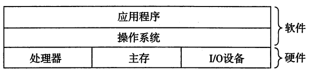
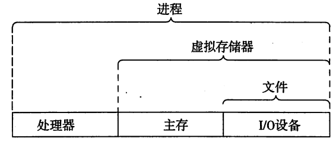

# 从hello world讲起

从最简单的hello world讲起: 这段程序将会经历: 创建->编译->运行->输出->终止.

```c
/* $begin hello */
#include <stdio.h>

int main()
{
    printf("hello, world\n");
}
/* $end hello */
```

```shell
gcc hello.c -o hello.exe
.\hello.exe
hello, world
```

## 信息

编辑完成的hello world源码会以信息的方式存储在计算机系统中.例如使用ASSII编码存储的上述源码文件可能类似:

```shell
  Offset: 00 01 02 03 04 05 06 07 08 09 0A 0B 0C 0D 0E 0F
00000000: 2F 2A 20 24 62 65 67 69 6E 20 68 65 6C 6C 6F 20    /*.$begin.hello.
00000010: 2A 2F 0D 0A 23 69 6E 63 6C 75 64 65 20 3C 73 74    */..#include.<st
00000020: 64 69 6F 2E 68 3E 0D 0A 0D 0A 69 6E 74 20 6D 61    dio.h>....int.ma
00000030: 69 6E 28 29 0D 0A 7B 0D 0A 20 20 20 20 70 72 69    in()..{......pri
00000040: 6E 74 66 28 22 68 65 6C 6C 6F 2C 20 77 6F 72 6C    ntf("hello,.worl
00000050: 64 5C 6E 22 29 3B 0D 0A 7D 0D 0A 2F 2A 20 24 65    d\n");..}../*.$e
00000060: 6E 64 20 68 65 6C 6C 6F 20 2A 2F                   nd.hello.*/
```

例如 字符 "#" ASCII 编码16进制表示为 __23__ (00000010 Offset 04), 二进制表示为 : 00100011, 在硬盘上, "#" 存储为 "00100011"

信息可以简单理解为 位 + 上下文 : 位即 0 or 1 ,上下文则是如何解释一串 0 1 所表示的内容.例如 : 00100011 可以表示 ASCII编码的字符 "#",同时也可以表示8位int值 : 35 . 不同的上下文中 相同的位可以表示不同的内容.

## 编译

C语言是一门高级语言,处理器只能识别特定指令集的,并不能直接执行C等高级语言,因此需要将上述helloworld 文件 *翻译* 成处理器能识别的指令集.这个过程称为编译.

C源码编译成可执行文件过程如下:


可以通过gcc 选项 查看每个步骤执行结果

```shell
gcc -E hello.c # 只预处理 -> .i
gcc -S hello.c # 预处理和编译 -> .s
gcc -c hello.c # 预处理 编译 汇编 -> .o
gcc hello.c # 预处理 编译 汇编 链接 -> .exe
```

* 预处理: 移除注释 ,include 文件插入
* 编译: 翻译为汇编语言
* 汇编: 汇编语言翻译为可重定位目标程序,使用机器语言编码
* 链接: 由于库函数printf的调用等 需要将多个 .o 链接为一个可执行文件hello (windows 下hello.exe)

## 处理器执行指令

当用户输入hello 并回车,CPU 会将 hello 文件的代码和数据从磁盘复制到主存.并逐步执行代码中的指令.


* I/O总线 : 以字(word)为单位,在各个组件之间传输数据.32位系统4个字节一个字,64 位系统8个字节一个字.
* I/O设备 : 输入输出设备
* 主存 : 临时存储设备,程序运行时,用来存储指令和数据,从逻辑上,主存可以看做连续一维数组,以字节为单位编址.
* 处理器 : 用来执行指令,主要部件 :PC、寄存器、ALU，基本操作为: 加载 存储 操作(运算) 跳转

## 高速缓存

处理器和主存之间的速度差别很大,高速缓存的存在就是为了缓冲这种巨大的速度差异的.高速缓存是使用一种SRAM的部件,由于成本,一般都不会很大.

## 存储层次


## 操作系统

操作系统处于进程和硬件中间,用于管理硬件以及进程,这样通过对硬件抽象,使进程更有效的调用硬件,避免进程直接操作硬件造成的低效或者隐患.同时管理进程,合理分配硬件资源.





* 进程

进程是操作系统对正在运行的应用程序的抽象,操作系统管理进程这一单位,实现硬件资源的复用: CPU切换,内存分配.


* 线程

线程是比进程更小的执行单元,线程属于进程,一个进程可以有一个或者多个线程.操作系统以进程为单位分配资源,进程之间资源相互独立,一个进程的线程之间则共享这些资源.

* 虚拟存储

虚拟存储是对主存的一种抽象,同样也是与进程相关,可以形成一种主存被一个进程独占的假象.通过操作系统的调度,让每个进程都能有相同的地址空间可以使用.屏蔽主存的差异性：例如有些电脑上主存为4G,有些电脑上主存为32G,对于进程来说,可以使用的地址空间大小是由操作系统定义的.


虚拟存储主要由以下部分构成:

* 程序指令和数据 : 程序载入区域
* 堆 : 通过类似C语言中的 malloc 或者 free 动态创建销毁一块区域存放数据
* 共享库
* 栈 : 程序运行使用,方法调用会在栈上在创建和销毁对应的帧
* 内核虚拟存储 : 内核部分 不可访问

* 文件

文件即字节顺序.

* 并发与并行

并发:同时进行多个活动

并行:通过并发(多线程),复用(CPU流水线),或者其他方式(SIMD)使多个活动同时进行或者看上去同时进行,以提升工作效率.

* 线程并发
* 指令并行: 将指令执行分为多个步骤,每个步骤使用一个CPU组件,这样CPU可以同时运行多个指令(每个指令使用不同的CPU组件)
* 数据并行(SIMD): 一个指令操作多个数据,例如Vector运算

## IPC(进程间通信)

进程过程间调用

* LPC:本地过程调用
* RPC:远程过程调用,通过计算机网络等进行通信