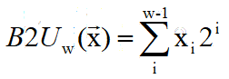
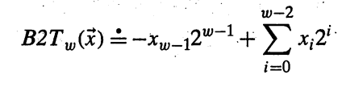
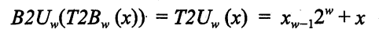
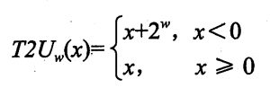
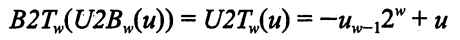
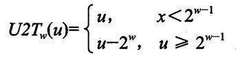
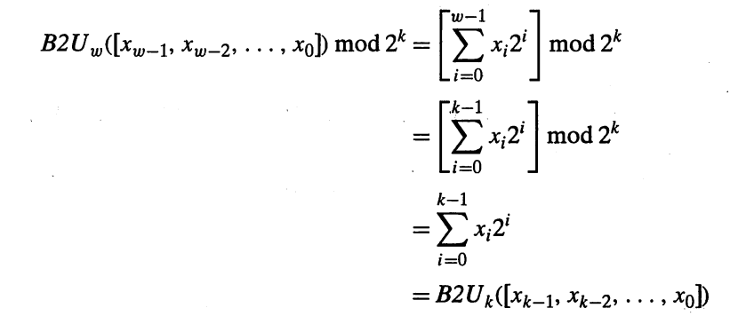

# 整数

## 无符号

一系列二进制数 [ xw-1,...,x2,x1 ] 表示的无符号整数使用如下公式计算 :



UMax = 2 ^ w -1

## 有符号

一系列二进制数 [ xw-1,...,x2,x1 ] 表示的无符号整数使用如下公式计算 (其中 最高位 xw-1 是符号位,称为负权):



TMax = 2 ^ (w -1) -1

TMin = -2 ^ (w -1)

## 转换

### 有符号->无符号





### 无符号->有符号





## 扩展

* 无符号数 : 0 扩展

```javascript
0000 0001 -> 0000 0000 0000 0001
1000 0001 -> 0000 0000 1000 0001
```

* 有符号数 : 符号扩展

```javascript
0000 0001 -> 0000 0000 0000 0001
1000 0001 -> 1111 1111 1000 0001
```

## 截断

