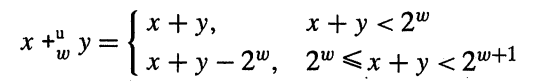
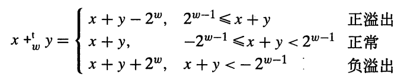
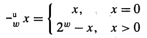
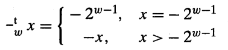
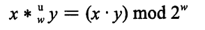
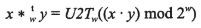
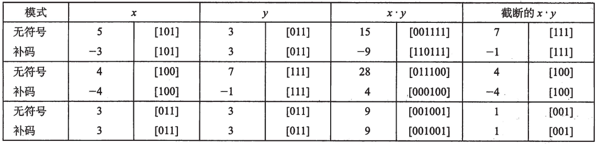
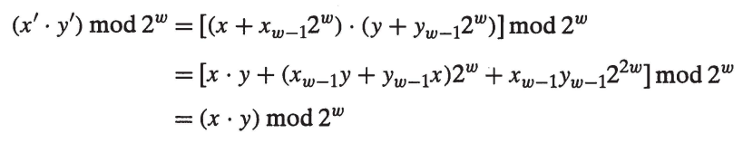
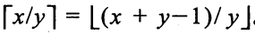

# 整数运算

## 无符号加法



检查无符号加法是否溢出

```c
int uadd_ok(unsigned x, unsigned y)
{
    unsigned result = x + y;
    return x <= result && y <= result;
}
```

## 补码加法



检查补码加法是否溢出

```c
int tadd_ok(int x, int y)
{
    if (x > 0 && y > 0)
    {
        return x + y > 0;
    }
    if (x < 0 && y > 0)
    {
        return x + y < 0;
    }
    return 1;
}
```

## 阿尔贝群

* 无符号数



* 补码



为什么不能用 下面方法判断溢出?

```c
int tadd_ok(int x, int y)
{
    int result = x + y;
    return (result - x == y ) && (result - y == x);
}
```

根据 阿尔贝群 ```x + (-x) = 0``` 所以 总会有 ```x + y - x = y```

对于任意整数值 : -x == ~x + 1

## 无符号乘法



## 补码乘法



对于补码乘法 先进行 __无符号乘法__ 和 __补码乘法__ 之后,再截断结果是一致的:



原因如下 : 对于补码 x , y , 对应的无符号整数分别为 x' , y' 则可以推算 :



## 乘以常数

* ```x * 2 ^ k = x << k```
* ```x * 14 = x * (8 + 4 + 2) = x * 8 + x * 4 + x * 2 = x << 3 + x << 2 + x << 1```

## 除以2的幂

* ```x / 2 ^ k = (x < 0 ? ( x + (1 << k) -1) : x ) >> k```

对于X < 0 的情况 , 当需要舍入时 x >> k 是向下舍入, 但是 x / 2 ^ k 期待的是 __向上舍入__ 因此,根据下面公式进行偏置:



 计算 x + (1 << k) -1 >> k , 即 x / 2 ^ k