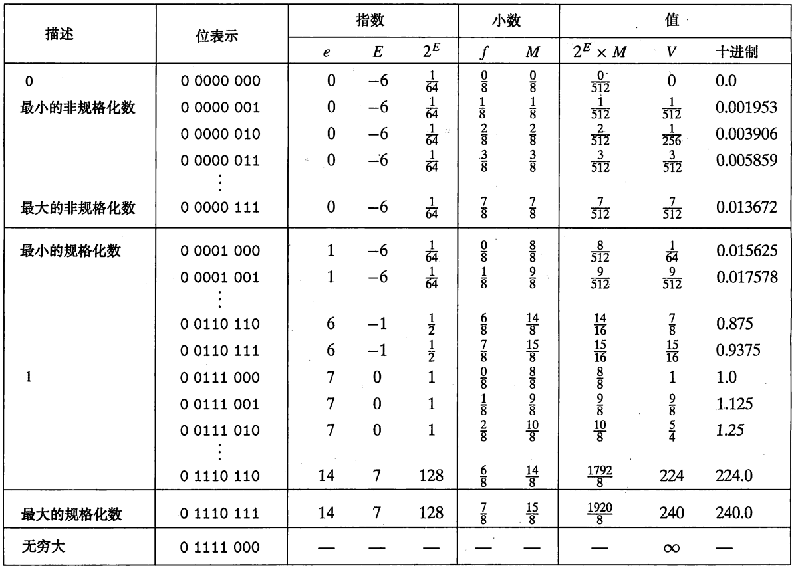
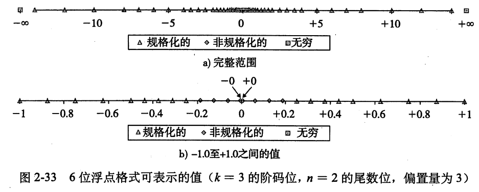

# 浮点数

## 基本结构

IEEE 浮点数标准中定义用```V = (-1)^s * M * 2^E```来表示一个浮点数:

* s : 符号,1位符号位s直接编码符号 s
* M : 尾数,n位小数字段 ```frac = f[n-1]f[kn-1]f[n-3]...f[0]``` 编码尾数 M
* E : 阶码,k位阶码字段 ```exp = e[k-1]e[k-1]e[k-3]...e[0]``` 编码阶码 E

单精度(32位表示)中 s exp frac 分布分别如下:

```shell
31 30... 23 22          ....              0
┌──────────────────────────────────────────┐
│s│  exp   │              frac             │
└──────────────────────────────────────────┘
```

其中s,exp,frac位数分别位 1,8,23,而双精度(64位表示)中s,exp,frac位数分别位 1,11,52

## 表示规则

Bias : k ^ (k-1) -1 (单精度 127,双精度 1023)

### 规格化 : exp 不全为 0 也不全为1

E = exp - Bias,因此 取值范围: -126 ~ 127 (单精度) 或者 -1022 ~ 1023 (双精度)

M = 1.frac

### 非规格化 : exp 全为 0

E = 1 - Bias,-126(单精度) 或者 -1022(双精度) : 1 - Bias 可以使非规格化到规格化部分平滑过渡

M = 0.frac

非规格化数 用来表示

* 0 : +0.0 -0.0
* 非常接近于0的数

### 特殊值 : exp 全为 1

frac 为 0 : 表示 正负无穷
frac 不为 0 : 表示 NaN

### 示例

* 用8位数据表示一个浮点数,k=4,n=3,则会得到如下图的示例



从图中可以看到,最大非规格化数到最小规格化数之间的平滑过渡,这是由于：

最大非规格化数 ： E = 1 - Bias , M = 0.111

最小规格化数 ： E = 1 - Bias , M = 1

最小规格化数与所有非规格化数的E实际都是一样的,因此分布平滑.

* 用6位数据表示一个浮点数,k=3,n=2,则可以表示的值在坐标轴上分布情况如下



可以看到非规格化数分布式非常均匀的,而规格化数越靠近0分布越密集.
