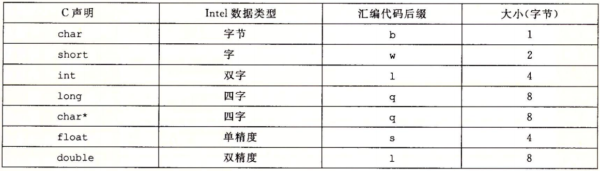

# 数据格式

## 字

由于是从16位系统演变到现在的,因此字的定义如下:

* Word : 字 , 2 bytes 16 bits
* Double Word : 双字 / 长字, 4 bytes 32 bits
* Quad Word : 四字 , 8 bytes 64 bits

对于 mov 有 movb(传送字节) movw(传送字) movl(传送双字/长字) movq(传送四字)这样的变种.

下面是操作不同数据结构时 汇编后缀(64位ISA):

> char * 根据ISA不同 可能是双字(32位) 或四字(64位)
>
> 8字节双精度浮点数汇编后缀也是 l