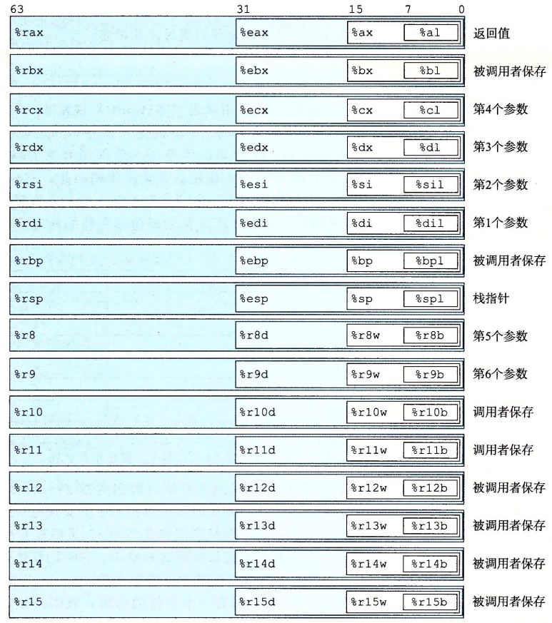
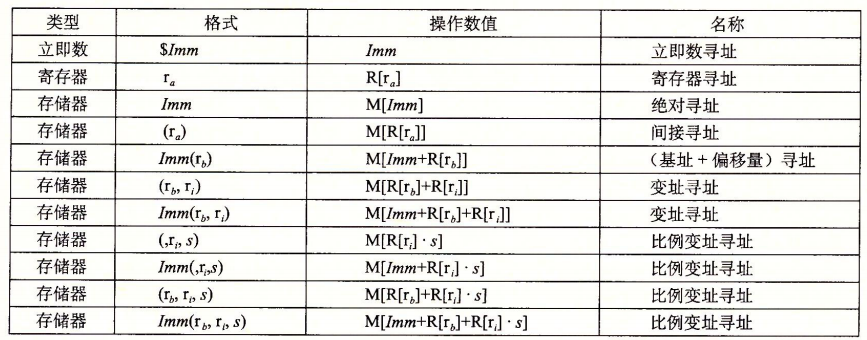
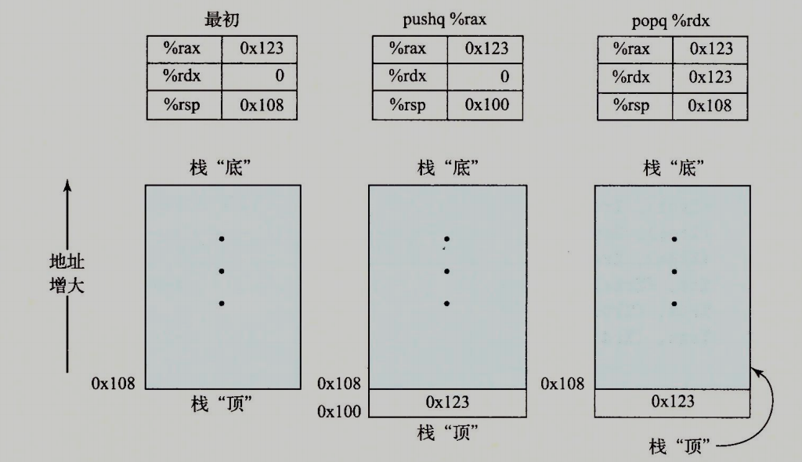

# 存取指令

一个 x86-64 CPU提供如下一些寄存器:



## 操作数

* 直接数 $Imm : Imm
* 寄存器 ra  : R[ra]
* 内存引用 Imm(rb,ri,s) : M[Imm + R[rb] + R[ri] * s], s 必须是 1 2 4 8

## 完整寻址模式



## 数据传送指令

### 简单传送:mov

* movb S,D
* movw S,D
* movl S,D
* movq S,D
* movabsq I,R : Source 只能是立即数 Destination 只能是寄存器

1. Source 位 立即数 寄存器 or 内存, Destination 位 寄存器 or 内存
2. 传送指令操作数不能都为内存操作数,内存->内存传送需要两条传送指令
3. 一般情况,mov指令只会更改指定的D部分,但是 movl(4字) 以寄存器(64位)位目的时会把高字节部分(4字)也设为0,这是为 32 位系统考虑而设计的
4. 在操作立即数时候,movq 只能将32位立即数符号填充移动到64寄存器,movabsq可以操作64位立即数.movq 和 movabsq 区别:
* [difference-between-movq-and-movabsq-in-x86-64](https://stackoverflow.com/questions/40315803/difference-between-movq-and-movabsq-in-x86-64)
* [whats-the-difference-between-the-x86-64-att-instructions-movq-and-movabsq](https://stackoverflow.com/questions/52434073/whats-the-difference-between-the-x86-64-att-instructions-movq-and-movabsq)

### 零扩展传送:movz

* movzbw
* movzbl
* movzbq
* movzwl
* movzwq
* l->q 零扩展传送 : 不存在 movzlq 这个指令,因为 movl 本身就会将 64位寄存器 高32位置位0 , 相当于零扩展.

### 符号扩展传送:movs

* movsbw
* movsbl
* movsbq
* movswl
* movswq
* movslq
* cltq : %eax 符号扩展到 %rax 相当于 ```movslq %eax  %rax```

## 数据传送示例

```c
long long exchange(long long *xp, long long y)
{
    long long x = *xp;
    *xp = y;
    return x;
}
/**
movq  (%rcx), %rax .*xp -> x
movq  %rdx, (%rcx) .y -> *xp
ret
*/
```

## 压栈&出栈

* pushq : pushq %rbp == ```subq $8,%rsp movq %rbp,(%rsp)```
* popq : popq %rbp == ```popq %rbp,(%rsp) addq $8,%rsp```

下面是一个栈操作过程示意图 :



注意: 栈是向低地址增长的