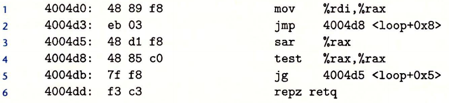
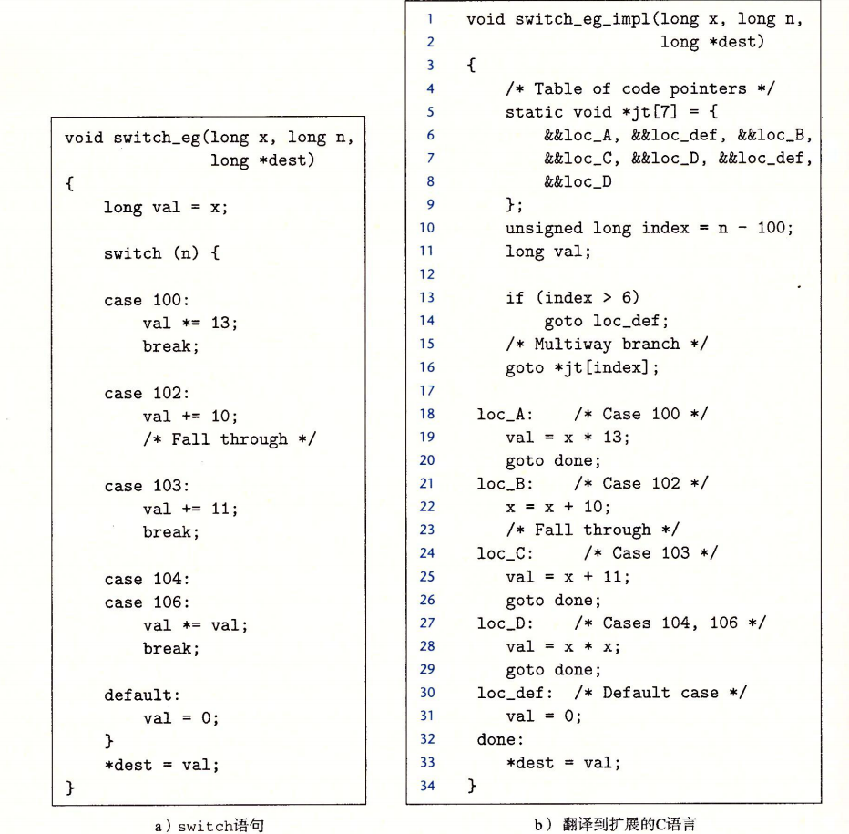
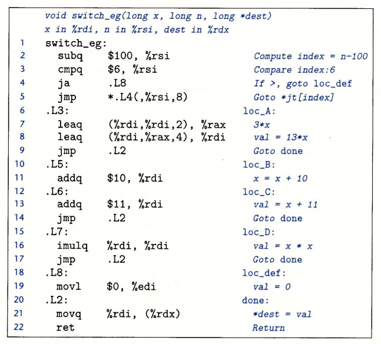

# 条件控制指令

## 条件码

CPU上维护了一组单个位的条件码寄存器 :

* CF : 进位,最近操作最高位是否产生进位
* SF : 符号,最近操作是否为负数
* ZF : 零标志位,最近操作是否为0
* OF : 溢出,最近操作是否溢出

### CMP和TEST

CMP 除了不更新 __目标值__ 外,功能与SUB相同

| 指令       | 效果    | 描述 |
| ---------- | ------- | ---- |
| cmp S1,S2  | S2 - S1 | 比较 |
| test S1,S2 | S2 & S1 | 测试 |

### SET指令

> SET : SET TO 1 WHEN XXX

| 指令    | 效果                  | 描述                        |
| ------- | --------------------- | --------------------------- |
| sete D  | D <- ZF               | 相等/零 (*setz*)            |
| setne D | D <- ~ZF              | 不等/非零 (*setnz*)         |
| sets D  | D <- SF               | 负数                        |
| setns D | D <- ~SF              | 非负数                      |
| setg D  | D <- ~(SF ^ OF) & ~ZF | > 有符号大于 (*setnle*)     |
| setge D | D <- ~(SF ^ OF)       | >= 有符号大于等于 (*setnl*) |
| setl D  | D <- SF ^ OF          | < 有符号小于 (*setnge*)     |
| setle D | D <- SF ^ OF\| ZF     | <= 有符号小于等于 (*setng*) |
| seta D  | D <- ~CF & ~ZF        | > 无符号大于 (*setnbe*)     |
| setae D | D <- ~CF              | >= 无符号大于等于 (*setnb*) |
| setb D  | D <- CF ^ OF          | < 无符号小于 (*setnae*)     |
| setbe D | D <- CF \| ZF         | <= 无符号小于等于 (*setna*) |

## 跳转指令

| 指令      | 跳转条件         | 描述                      |
| --------- | ---------------- | ------------------------- |
| jmp Label | 1                |                           |
| jmp *Op   | 1                | *%rax  *(%rax)            |
| je Label  | ZF               | 相等/零 (*jz*)            |
| jne Label | ~ZF              | 不等/非零 (*jnz*)         |
| js Label  | SF               | 负数                      |
| jns Label | ~SF              | 非负数                    |
| jg Label  | ~(SF ^ OF) & ~ZF | > 有符号大于 (*jnle*)     |
| jge Label | ~(SF ^ OF)       | >= 有符号大于等于 (*jnl*) |
| jl Label  | SF ^ OF          | < 有符号小于 (*jnge*)     |
| jle Label | SF ^ OF\| ZF     | <= 有符号小于等于 (*jng*) |
| ja Label  | ~CF & ~ZF        | > 无符号大于 (*jnbe*)     |
| jae Label | ~CF              | >= 无符号大于等于 (*jnb*) |
| jb Label  | CF ^ OF          | < 无符号小于 (*jnae*)     |
| jbe Label | CF \| ZF         | <= 无符号小于等于 (*jna*) |

### 跳转指令编码

跳转指令使用 目标指令地址与跳转指令的下一条地址之间的差作为跳转编码

如下图:



第二行中 jmp 到  0x4004d8 下一条指令地址为 0x4004d5 , 因此  03 = 0x4004d8 - 0x4004d5 编码为 ```eb 03```

## 分支

### 条件控制

```javascript

if(test-expr){
    then-statement
}else{
    else-statement
}

// 等价于
t = test-expr
if(!t){
    goto false
}
true:
    then-statement
    goto done
false:
    else-statement
done:

```

### 条件传送

| 指令       | 跳转条件         | 描述                         |
| ---------- | ---------------- | ---------------------------- |
| cmove S,R  | ZF               | 相等/零 (*cmovz*)            |
| cmovne S,R | ~ZF              | 不等/非零 (*cmovnz*)         |
| cmovs S,R  | SF               | 负数                         |
| cmovns S,R | ~SF              | 非负数                       |
| cmovg S,R  | ~(SF ^ OF) & ~ZF | > 有符号大于 (*cmovnle*)     |
| cmovge S,R | ~(SF ^ OF)       | >= 有符号大于等于 (*cmovnl*) |
| cmovl S,R  | SF ^ OF          | < 有符号小于 (*cmovnge*)     |
| cmovle S,R | SF ^ OF\| ZF     | <= 有符号小于等于 (*cmovng*) |
| cmova S,R  | ~CF & ~ZF        | > 无符号大于 (*cmovnbe*)     |
| cmovae S,R | ~CF              | >= 无符号大于等于 (*cmovnb*) |
| cmovb S,R  | CF ^ OF          | < 无符号小于 (*cmovnae*)     |
| cmovbe S,R | CF \| ZF         | <= 无符号小于等于 (*cmovna*) |

条件传送没有预测失败惩罚

## 循环

### do-while

```javascript
do{
    body-statement
}while(test-expr)

loop:
    body-statement
    t = test-expr
if(t){
    goto loop
}
```

### while

```javascript
while(test-expr){
    body-statement
}

// trans
goto test
loop:
    body-statement
test:
    t = test-expr
    if(t){
        goto loop
    }
done:
```

### for

```javascript
for(init-expr;test-expr;update-expr){
    body-statement
}

// trans
init-expr
goto test
loop:
    body-statement
    update-expr
test:
    t = test-expr
    if(t){
        goto loop
    }
done:
```

## switch



上述代码翻译为汇编 :

