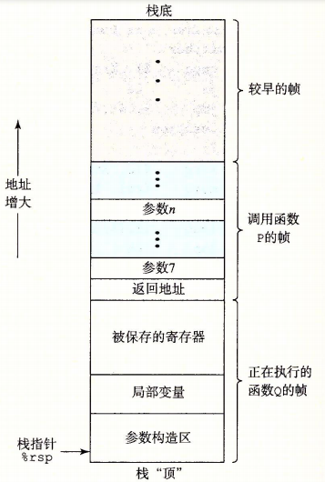
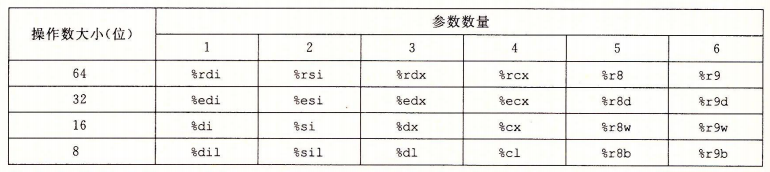

# 过程调用

封装代码,接收一组参数和提供一个返回值.

## 运行时栈

过程调用使用栈结构提供 __先进后出__ 的内存管理方式.

下图是过程P调用过程Q时栈的情况.需要注意的是栈是从高地址向低地址增长的.



## 转移控制

* call
* ret

```c
#include <stdio.h>

long leaf(long y)
{
    return y + 2;
}

long top(long x)
{
    long result = leaf(x - 5);
    return result + result;
}

int main()
{
    top(100);
    return 0;
}
```

可以查看 [编译后汇编代码](./src/3.06.1.s)

## 数据传送

* 当P调用Q时,P必须把参数复制到对应的寄存器中
* 当Q的参数超过7个时,则需要利用栈,将1-6号参数复制到寄存器,7-n号寄存器复制到栈中
* 当使用栈传递参数时候,所有数据大小都向8的倍数对齐.
* 当Q需要访问参数时,直接访问寄存器,或者 从 8(%rsp) 向上访问
* 当调用返回前,Q需要负责把返回值复制到 %rax 寄存器中.



```c
void proc(long x1, long *x2p, int x3, int *x4p, short x5, short *x6p, char x7, char *x8p)
{
    *x2p += x1;
    *x4p += x3;
    *x6p += x5;
    *x8p += x7;
}
```

可以查看 [编译后汇编代码](./src/3.06.2.s)

部分代码如下：

```s
proc:
.LFB0:
        .cfi_startproc
        movq    16(%rsp), %rax //x8p(指针是64bit，占用8个地址) -> %rax
        addq    %rdi, (%rsi)
        addl    %edx, (%rcx)
        addw    %r8w, (%r9)
        movl    8(%rsp), %edx // x7 -> %edx
        addb    %dl, (%rax)
        ret
        .cfi_endproc
.LFE0:
```

## 局部存储

### 栈上局部存储

以下情况下必须使用内存存放局部变量或参数：

* 寄存器大小不足
* 对变量使用地址运算符
* 变量是数组 or 结构 可以通过引用访问到

可以查看示例:

* [3.06.3](./src/3.06.3.c) 以及[编译后汇编代码](./src/3.06.3.s)
* [3.06.2](./src/3.06.2.c) 以及[编译后汇编代码](./src/3.06.2.s)

### 寄存器上的局部存储空间

* %rsp
* 被调用者保存 : %rbx %rbp %r12 %r13 %r14 %r15
* 调用者保存 : %rdi %rsi %rdx %rcx %r8 %r9(1-6号参数) %rax(返回值) 以及 %r10 %r11

## 递归过程

示例

```c
long rfact(long n)
{
    long result;
    if (n <= 1)
    {
        result = 1;
    }
    else
    {
        result = n * rfact(n - 1);
    }
    return result;
}
```

对应的汇编

```s
rfact:
        .cfi_startproc
        movl    $1, %eax
        cmpq    $1, %rdi
        jle     .L6
        pushq   %rbx // 被调用者保存寄存器 %rbx
        .cfi_def_cfa_offset 16
        .cfi_offset 3, -16
        movq    %rdi, %rbx // 保存 n -> %rbx
        leaq    -1(%rdi), %rdi // 计算 n-1 -> %rdi
        call    rfact
        imulq   %rbx, %rax
        popq    %rbx
        .cfi_restore 3
        .cfi_def_cfa_offset 8
.L6:
        rep ret
        .cfi_endproc
```