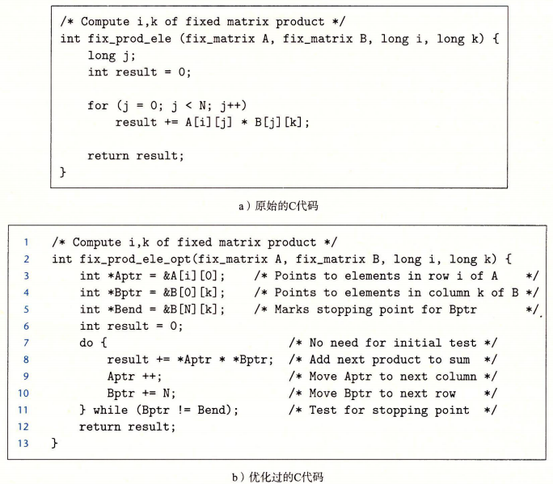

# 数组

```c
void array_proc()
{
    int array[5][5];
    array[0][0] = 0;
    array[1][1] = 11;
    array[2][2] = 22;
    array[3][3] = 33;
    array[4][4] = 44;
}
```

```s
 array_proc:
        .cfi_startproc
        pushq   %rbp
        .cfi_def_cfa_offset 16
        .cfi_offset 6, -16
        movq    %rsp, %rbp
        .cfi_def_cfa_register 6
        subq    $112, %rsp
        movq    %fs:40, %rax
        movq    %rax, -8(%rbp)
        xorl    %eax, %eax
        movl    $0, -112(%rbp) // 00
        movl    $11, -88(%rbp) // 00 + 20 + 4
        movl    $22, -64(%rbp) // 00 + 40 + 8
        movl    $33, -40(%rbp) // 00 + 60 + 12
        movl    $44, -16(%rbp) // 00 + 80 + 16
        nop
        movq    -8(%rbp), %rax
        xorq    %fs:40, %rax
        je      .L2
        call    __stack_chk_fail
.L2:
        leave
        .cfi_def_cfa 7, 8
        ret
        .cfi_endproc
```

## 定长数组




## 变长数组

C 不支持变长数组,只能malloc或calloc,但是数组长度可以使用表达式,在使用时候才能计算出