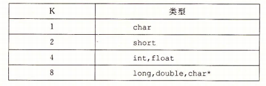
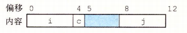
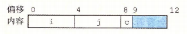
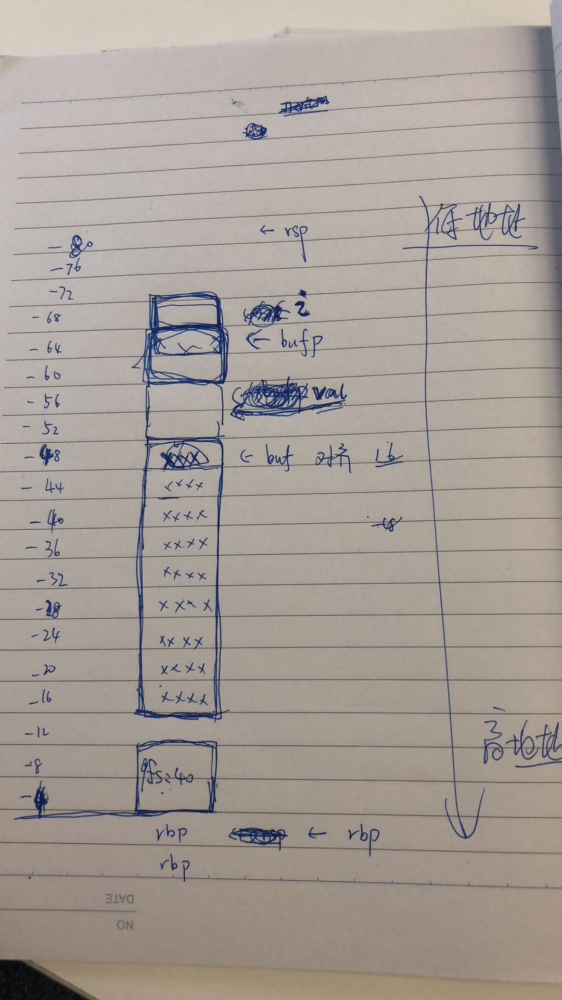

# 数据结构

## 结构

结构(struct) 是将不同的类型放在一块连续的内存区域中,指向结构的指针就是结构第一个字节的地址

例如如下代码

```c
struct rec
{
    int i;
    int j;
    int a[2];
    int *p;
};

void createRec()
{
    struct rec r;
    int i = 1;
    r.i = 10;
    r.j = 20;
    r.a[0] = 30;
    r.a[1] = 40;
    r.p = &i;
}
```

部分汇编如下:

```s
    movl    $1, -36(%rbp)
    movl    $10, -32(%rbp)   ; rec.i
    movl    $20, -28(%rbp)   ; rec.j
    movl    $30, -24(%rbp)   ; rec.a[0]
    movl    $40, -20(%rbp)   ; rec.a[1]
    leaq    -36(%rbp), %rax  ; &i
    movq    %rax, -16(%rbp)  ; rec.p
```

## 联合

多个共用公用一块区域的内存

```c
// 在小端机器上 double 值为 word1 word0
// 大端机器上 恰好相反 : word0 word1
double uu2double(unsigned word0, unsigned word1)
{
    union {
        double d;
        unsigned u[2];
    } temp;

    temp.u[0] = word0;
    temp.u[1] = word1;
    return temp.d;
}
```

## 数据对齐

内存读取总是以4字节(32位) or 8字节(64位)进行的,如果所有地址都是以4字节或者8字节对齐可以提高内存读取效率

对齐原则 :

* 基本数据结构,指针等按照K对齐



* 数组,结构,整个栈帧等按照 2^n 对齐, n 默认值由gcc 定义 一般为 4 (16 bytes),可以通过参数 ```-mpreferred-stack-boundary=``` 控制

```c
struct S1
{
    int i;
    char c;
    int j;
};

struct S2
{
    int i;
    int j;
    char c;
};
```

以4字节对齐为例 :

```struct S1 s1``` 对齐方式 :



```struct S2 s2s[4]``` 其中一个元素的对齐方式 :



实际中的对齐 : 16 bytes 对齐

```c
#include <stdio.h>

unsigned long long getbuf()
{
  char buf[36];
  volatile char* bufp = &buf;
  buf[0] = 1;
  int i = 2;
  unsigned long long val = buf; 
  printf("%llx %llx %llx %llx\n", bufp, i, val, *bufp); 
  return val % 40;
}

int main()
{
    getbuf();
    return 0;
}
```

```s
        .file   "main.c"
        .section        .rodata
.LC0:
        .string "%llx %llx %llx %llx\n"
        .text
        .globl  getbuf
        .type   getbuf, @function
getbuf:
.LFB0:
        .cfi_startproc
        pushq   %rbp
        .cfi_def_cfa_offset 16
        .cfi_offset 6, -16
        movq    %rsp, %rbp
        .cfi_def_cfa_register 6
        subq    $80, %rsp
        movq    %fs:40, %rax
        movq    %rax, -8(%rbp)
        xorl    %eax, %eax
        leaq    -48(%rbp), %rax
        movq    %rax, -64(%rbp)
        movb    $1, -48(%rbp)
        movb    $1, -47(%rbp)
        movl    $2, -68(%rbp)
        leaq    -48(%rbp), %rax
        movq    %rax, -56(%rbp)
        movq    -64(%rbp), %rax
        movzbl  (%rax), %eax
        movsbl  %al, %esi
        movq    -56(%rbp), %rcx
        movl    -68(%rbp), %edx
        movq    -64(%rbp), %rax
        movl    %esi, %r8d
        movq    %rax, %rsi
        movl    $.LC0, %edi
        movl    $0, %eax
        call    printf
        movq    -56(%rbp), %rcx
        movabsq $-3689348814741910323, %rdx
        movq    %rcx, %rax
        mulq    %rdx
        shrq    $5, %rdx
        movq    %rdx, %rax
        salq    $2, %rax
        addq    %rdx, %rax
        salq    $3, %rax
        subq    %rax, %rcx
        movq    %rcx, %rdx
        movq    %rdx, %rax
        movq    -8(%rbp), %rdi
        xorq    %fs:40, %rdi
        je      .L3
        call    __stack_chk_fail
.L3:
        leave
        .cfi_def_cfa 7, 8
        ret
        .cfi_endproc
.LFE0:
        .size   getbuf, .-getbuf
        .globl  main
        .type   main, @function
main:
.LFB1:
        .cfi_startproc
        pushq   %rbp
        .cfi_def_cfa_offset 16
        .cfi_offset 6, -16
        movq    %rsp, %rbp
        .cfi_def_cfa_register 6
        movl    $0, %eax
        call    getbuf
        movl    $0, %eax
        popq    %rbp
        .cfi_def_cfa 7, 8
        ret
        .cfi_endproc
.LFE1:
        .size   main, .-main
        .ident  "GCC: (Ubuntu 5.4.0-6ubuntu1~16.04.4) 5.4.0 20160609"
        .section        .note.GNU-stack,"",@progbits
```

图解 :



由于使用 16 bytes 对齐 :

* canary number 占据 8 bytes
* buf 数组大小 36 byets,使用 16 bytes 对齐, 因此开始地址对齐到 48
* val bufp i 按照各自sizeof大小对齐
* 栈帧最终16byte对齐 大小为80 bytes