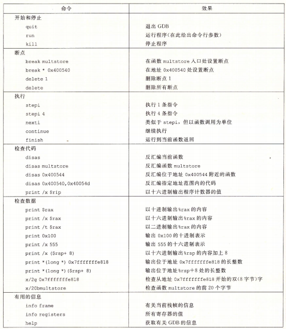

# 数据与控制

## 指针

* 每个指针都有一个类型: 指针类型是C语言防止寻址错误等问题的抽象,并没有对应的机器语言
* 每个指针都有值
* "&" 创建指针
* "*" 间接引用指针
* 数组名可以像指针一样引用但是不可修改
* 强转指针类型不会改变值
* 函数指针

```c
int func(int a,int *bp);
int (*funcp)(int,int *);
funcp = func;
int y = 3;
funcp(1,&y);
```

## 内存越界引用和缓冲区溢出

### 缓冲区溢出

如下面代码, echo 中调用 gets 将console 输入读取到 buf[8] 中,但是 buf8 太小了,当输入长度超过8时,会导致栈上的数据被破坏:

* 当前栈帧的高位地址
* __上一个栈帧的返回地址__
* 上一个栈帧数据

```c
/* Demonstration of buffer overflow */
#include <stdio.h>
#include <stdlib.h>
/* $begin 450-bufdemo-c */
/* Implementation of library function gets() */
char *gets(char *s)
{
    int c;
    char *dest = s;
    while ((c = getchar()) != '\n' && c != EOF)
    {
        *dest++ = c;
    }
    if (c == EOF && dest == s)
    { /* No characters read */
        return NULL;
    }
    *dest++ = '\0'; /* Terminate string */
    return s;
}

/* Read input line and write it back */
void echo()
{
    char buf[8]; /* Way too small! */
    gets(buf);
    puts(buf);
}
/* $end 450-bufdemo-c */

/* $begin 450-bufdemo-ans-c */
/* Read input line and write it back */
/* Code will work for any buffer size.  Bigger is more time-efficient */
#define BUFSIZE 8
void good_echo()
{
    char buf[BUFSIZE];
    char *bp = fgets(buf, BUFSIZE, stdin);
    if (bp)
    {
        puts(bp);
    }
}
/* $end 450-bufdemo-ans-c */

int main(int argc, char *argv[])
{
    int use_good = (argc > 1);
    printf("Type a string:");
    if (use_good)
    {
        good_echo();
    }
    else
    {
        echo();
    }
    return 0;
}
```

> 注意 编译的时候请使用参数 -fno-stack-protector 关闭 [栈破坏检测代码](#栈破坏检测)

## gdb



## 对抗缓冲区溢出攻击

### 栈随机化

程序开始时在栈上分配随机一段空间,程序不使用这段空间

### 栈破坏检测

如果检测到栈帧会有char 类型缓冲区,gcc 会在每个栈帧开始时,插入canary number(%fs:40,随机数),栈帧结束时,检测随机数是否改变

```s
    ......
    movq    %fs:40, %rax
    movq    %rax, -8(%rbp)
    ......
    movq    -8(%rbp), %rax
    xorq    %fs:40, %rax
    je      .L4
    call    __stack_chk_fail
.L4:
    leave
    ret
```

### 限制可执行代码区域

只有代码段才是可执行的,其他区域只能读或写,虚拟内存空间上的"页"会被标记可读,可写,可执行等.

## 变长栈帧

%rbp : 帧指针 / 基指针
%rsp : 栈指针