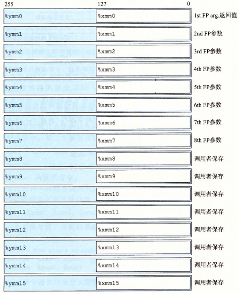
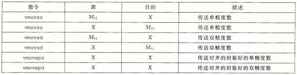
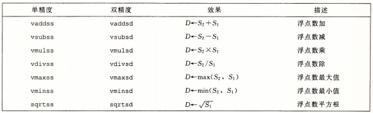
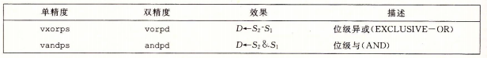
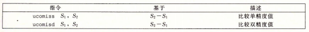
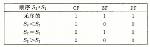

# 浮点数

SIMD : 单指令多数据

MMX -> SSE -> AVX

AVX 寄存器如下 :



* 使用 0-7 传递参数
* 0 返回值
* 所有寄存器都是调用者保存的

AVX 指令



> X : XMM 寄存器
>
> M : 内存地址

```c
float float_mov(float v1, float *src, float *dst) {
    float v2 = *src;
    *dst = v1;
    return v2;
}

/*
        ; gcc -O1 -S -mavx2 main.c && cat main.s
        .file   "main.c"
        .text
        .globl  float_mov
        .type   float_mov, @function
float_mov:
.LFB0:
        .cfi_startproc
        vmovss  (%rdi), %xmm1
        vmovss  %xmm0, (%rsi)
        vmovaps %xmm1, %xmm0
        ret
        .cfi_endproc
.LFE0:
        .size   float_mov, .-float_mov
        .ident  "GCC: (Ubuntu 5.4.0-6ubuntu1~16.04.4) 5.4.0 20160609"
        .section        .note.GNU-stack,"",@progbits
*/
```

## 浮点数运算



## 浮点数常数

```c
double cel2fahr(double temp)
{
    return 1.8 * temp + 32.0;
}

/*
cel2fahr:
        vmulsd  .LC2(%rip), %xmm0, %xmm0
        vaddsd  .LC3(%rip), %xmm0, %xmm0
        ret

.LC2:
        .long   3435973837
        .long   1073532108
        .align 8
.LC3:
        .long   0
        .long   1077936128
        .align 8
*/
// 1073532108 3435973837 (0x3ffccccc cccccccd)
// s = 0
// exp = 0x3ff = 1023
// E = 0
// frac = 0xccccccccccccd
// M = 1.8
// V = 1.8
```

## 浮点数位级操作



## 浮点数比较操作



设置Flag寄存器

