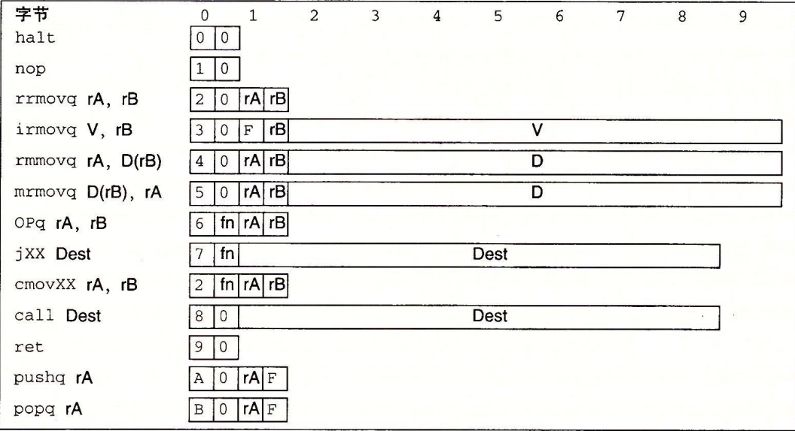

# Y86-64

## 状态

* 寄存器:
  * %rax %rcx %rdx %rbx %rsp %rbp %rsi %rdi %r8 %r9 %r10 %r11 %r12 %r13 %r14 (编号 0-E,F代表没有寄存器)
  * 栈指针 %rsp
* CC 条件码 保存最近一次计算结果
  * ZF : 结果为0
  * SF : 结果进位
  * OF : 结果溢出
* PC : 当前正在执行的指令地址
* 内存 : DMEM 虚拟地址
* 程序状态 Stat

## 指令

* XXmovq : 传送
  * irmovq rrmovq rmmovq mrmovq (20 30 40 50)
  * 立即数(i) 寄存器(r) 内存(m),
  * 内存寻址方式为寄存器基址+偏移量
* OPq : 计算并设置条件码 CC
  * addq, subq, andq, xorq (60 61 62 63)
* jXX : 跳转指令
  * jmp, jle, jl, je, jne, jge, jg (70 71 72 73 74 75 76)
* cmovXX : 条件传送
  * cmovle, cmovl, cmove, cmovne, cmovge,cmovg (21 22 23 24 25 26)
  * 寄存器to寄存器
* call (80)
* ret (90)
* pushq (A0)
* popq (B0)
* halt (00)
* nop (10)

## 编码

10个字节

* icode:ifun : 字节0
* 寄存器 rA rB (如果有): 字节1
* 立即数 : 大端,0x123456789abcd 填充后 变成 00 01 23 45 67 89 ab cd,然后大端方式存取 内存中存储为 cd ab 89 67 45 23 01 00

## 异常

* AOK 正常操作
* HLT HALT操作
* ADR 非法地址
* INS 非法指令