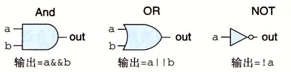
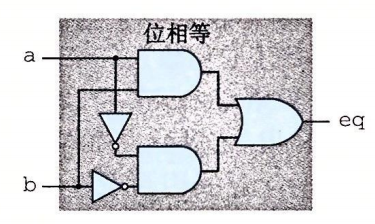
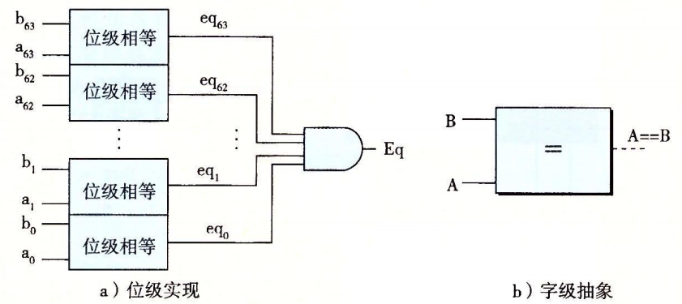
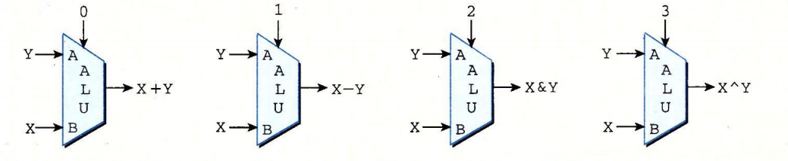
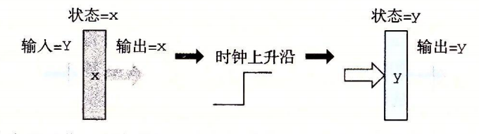
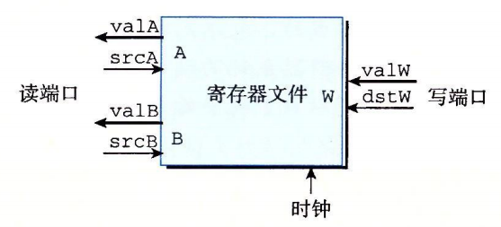
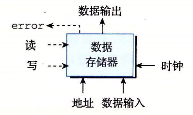

# 逻辑电路

## 逻辑门和组合电路

基本逻辑门 : 与 或 非

### 位级组合电路 : bool eq = (a && b) || (!a && !b)

### 字级组合电路 bool eq = A == B

### ALU

根据输入信号 做不同的运算

## 存储器和时钟

### 时钟寄存器 PC CC Stat

* 输出线上一直存储的值
* 时钟高电平时 将输入线上的值加载到存储区

### 寄存器文件 可寻址寄存器 %rxx

* srcA or srcB设置为一个id,延迟一段时间,valA or valB 输出对应的值
* dstW 设置为一个值 时钟上升沿 将 valW 加载到存储区域

### 主存 虚拟地址访问的DRAM

* 时钟上升沿载入输入线上的值到存储区

