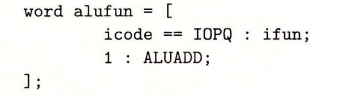

# Y86-64 SEQ

## 执行阶段

* 取指 icode ifun rA rB valC 计算下一个指令地址 valP
* 译码 通过 rA rB or %rsp 获取到 valA valB
* 执行 ALU 计算得到 valE
* 访存 写入内存,or 读出内存 valM
* 写回 更新寄存器 rA rB or %rsp
* 更新PC PC <- valP or valC (jXX)

## 硬件

## 时序

* addq %rdx,%rbx
  * ① : 0x14 更新到PC (上升沿)
  * 取指 译码 执行
  * ② : 产生新的CC值(000) 和 %rbx值(0x300) 以及 PC值(0x16) 输出到输入线上(还没有更新到对应的寄存器以及寄存器文件)
* je dest
  * ③ : 0x16 更新到PC, 000 更新到CC, 0x300 更新到%rbx (上升沿)
  * 取指 译码 执行
  * ④ : 产生新的CC值(000)以及 PC值(0x1f)
* ...

## 实现

### 取指

1. 读取10个字节,第一个字节处理为 icode:ifunc
2. 根据icode和ifunc,计算instr_valid,need_regids,need_valc
3. Align 根据need_regids,need_valc处理处 rA, rB, valC
4. PC增加单元根据当前PC以及need_regids,need_valc得到下一个PC

### 译码与写回

srcA和srcB的HCL表示为:

dstE的HCL表示为:

### 执行

ALU输入为 ifunc valA valB 输出为 valE

ALUA的 HCL 表示为(根据icode 可以是 valA valC or +8 -8等):

### 访存

Mem.addr hcl 表示为 (可能为立即数 也可能为 valA):

### 更新PC

## 问题

一个时间点只有一个部件被使用,因此将会引入流水线概念,提高系统吞吐量,但是也会一定程度上增加延迟