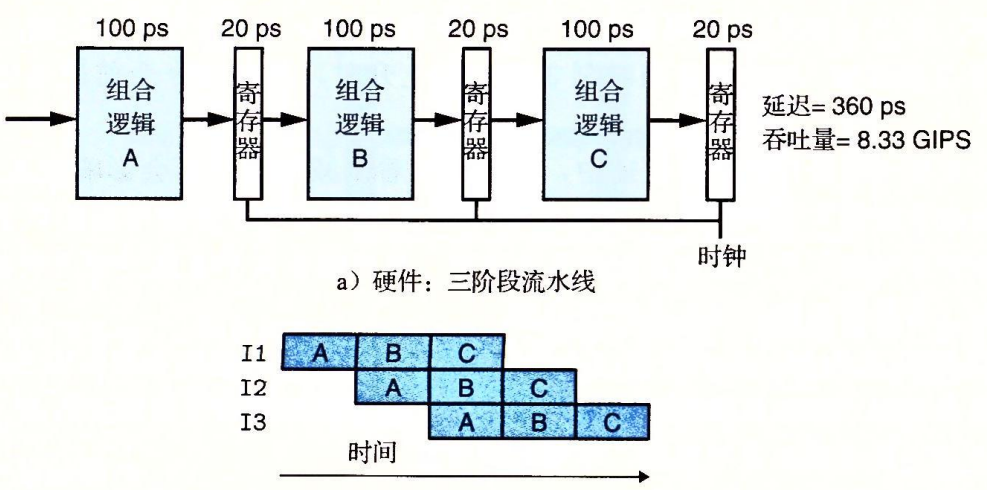

# 流水线

## 吞吐量和延迟

正常情况下 指令 I1 I2 I3执行顺序如下:


```shell
吞吐量 = 1 / ( 20 ps + 300 ps) * 1000 ps / 1ns = 3.12 GIPS
延迟 320 ps
```

但是如果将指令分为多个阶段(组合逻辑 A B C) 每个阶段都对应一次寄存器访问. 可以优化为如下执行顺序:



```shell
吞吐量 = 3 / ( 360 ps) * 1000 ps / 1ns = 8.33 GIPS
延迟 360 ps
```

## 局限性

### 不一致划分

如果每个组合逻辑阶段时间不一样会出现:


### 流水线过深收益下降


### 带反馈的流水线

流水线上的指令之间可能有依赖关系,例如 指令I1 的输出(例如输出到 %rax)是指令I2的输入,如果不带流水线的执行,不会出现问题,I1输出到 %rax 等到I2执行时,刚好可以获取到期望中的值.

但是如果考虑上流水线,则可能会出现下面的情况:


等到指令I1 的输出(例如输出到 %rax),I2已经执行完了,而I4读取到了这个输出,这不是期望中的行为,需要避免