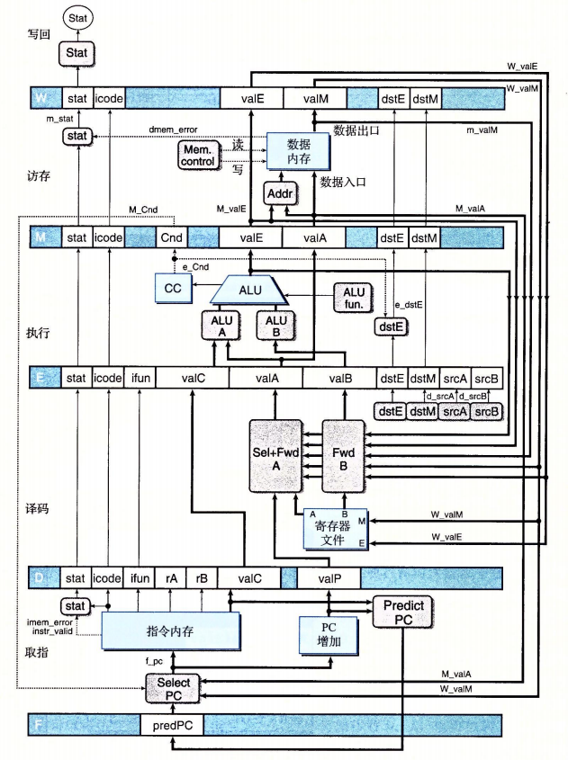
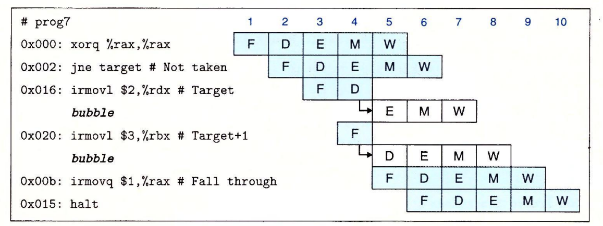
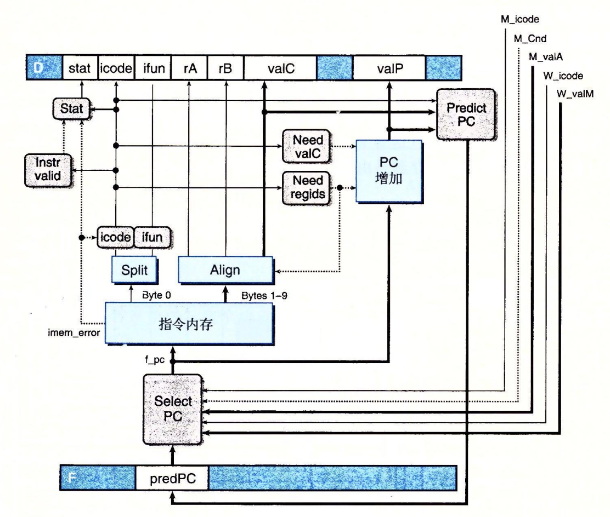
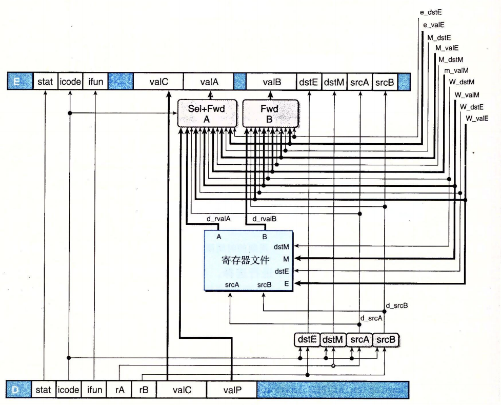
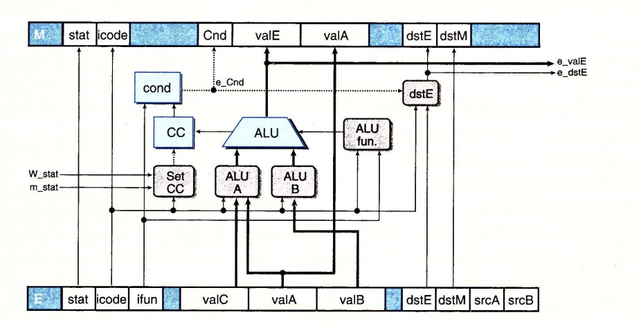
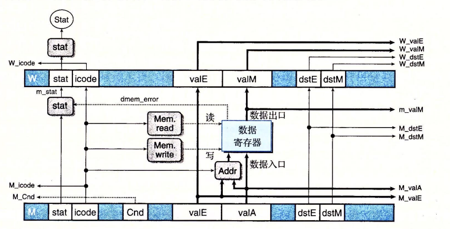
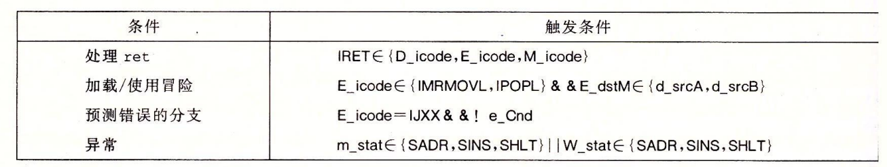

# Y86-64 流水线

针对之前的SEQ顺序架构,做以下调整使之成为一个性能有所提升的流水线设计:

## SEQ+

PC计算从上一个指令的最后调整到当前指令的最开始

## 插入流水线寄存器

增加流水线寄存器(硬件):

* F : 保存程序计数器预测值(由PC增加计算得到)
* D : 取指结果
* E : 译码指令和寄存器值
* M : 执行结果以及CC
* W : 反馈路径写回,以及ret地址

```s
irmovq $1,%rax
irmovq $2,%rbx
irmovq $3,%rcx
irmovq $4,%rdx
halt
```


需要注意的是: Select A 块 : 由于 valP只有在call和jXX时会使用,并且在这两个指令中不会使用valA因此可以用寄存器的这一部分valA 通过Select A选取数据携带带使用的地方,这样就可以减少连线

## 预测下一阶段PC

* 除了 jXX ret call外,总是可以确定下一个PC的值(valP).
* call jmp 下一个PC是 valC
* jXX 可能是 valC 也可能是 valP 既可以预测选择了分支,也可以预测没有选择分支,最简单的策略,一般倾向于预测选择了分支(实际中会更加复杂)

上面的图中 Predict PC 块负责预测下一个PC的值并更新到 F_predPC

## 流水线冒险

流水线上的不同指令之间读写程序寄存器,程序计数器,内存,条件码寄存器,状态寄存器的先后顺序不一致,会导致流水线冒险.即读到的不是期望的值.

可以通过以下方式处理冒险的情况:

### 暂停与气泡

* stall : 控制寄存器保持当前状态
* 气泡 (*bubble*) 动态插入 nop,相当于执行了nop 并复位每个阶段的寄存器状态

目的是延缓指令执行或者延后某个流水线阶段执行.

### 转发

增加连线可以将先执行的指令中某个阶段的值转发到后执行的指令的某个阶段



### 加载/使用

前一个指令读取(一般是读取内存)还没有进行,下一个指令已经到了执行阶段需要这个值,因此只是转发是无法解决的,需要暂停+转发

### 避免控制冒险

当遇到分支or `ret` 时,插入气泡消除可能出现的错误指令



## 异常处理

* 流水线最深的指令引发异常优先级越高
* 应该避免由于错误的分支预测引发的异常
* 流水线上的指令在发生异常后改变了状态

## 流水线各个阶段

### PC选择和取指

PC需要预测,值从三个地方获取:

* 分支指令jXX进入访存阶段时取 M_valA
* ret 指令进入写回阶段时取 W_valM
* 其他取 F_predPC



### 译码与写回

这一阶段涉及到转发逻辑,以及D->E过程中需要合并valP 和valA(没有哪个指令同时需要这两个值)

指令从 D->E 过程中,需要处理转发逻辑. 判断是否需要从 M或者 W阶段的指令中转发需要的值.



Sel Fwd A 的 HCL:

```shell
word d_valA =[
    D_icode IN { ICALL,IJXX} : D_valP
    d_srcA == e_destE : e_valE; # 取指执行阶段的结果
    d_srcA == M_destM : m_valM; # 访存阶段将要写入的值
    d_srcA == M_destE : M_valE; # 访存阶段要写入的值
    d_srcA == W_destM : W_valM; # 写回阶段要写入的值
    d_srcA == W_destE : W_valE; # 写回阶段要写入的值
]
```

### 执行阶段



执行阶段需要考虑译码阶段的转发逻辑,同时需要考虑异常的情况 : SetCC 需要同时考虑 m_Stat 和 W_Stat

### 访存



## 流水线控制逻辑

本小节讲述流水线应对特殊情况的检测和处理

* 加载使用冒险
* ret
* 预测错误的分支
* 异常

1. 特殊情况的处理:
    1. mrmovq 和 pop 在执行状态并且需要的目标寄存器处于译码状态需要插入气泡
    2. ret 插入气泡
    3. 跳转分支到了执行阶段如果检测到分支预测错误,需要插入气泡取消不正确的两个已经取指译码的指令
    4. 异常: 阻止改变状态
2. 发现特殊情况
   

## 性能分析

* 每周期指令数
* 延迟

## 未完成工作

* 多周期指令
* 存储器接口 : 读写内存,速度差异