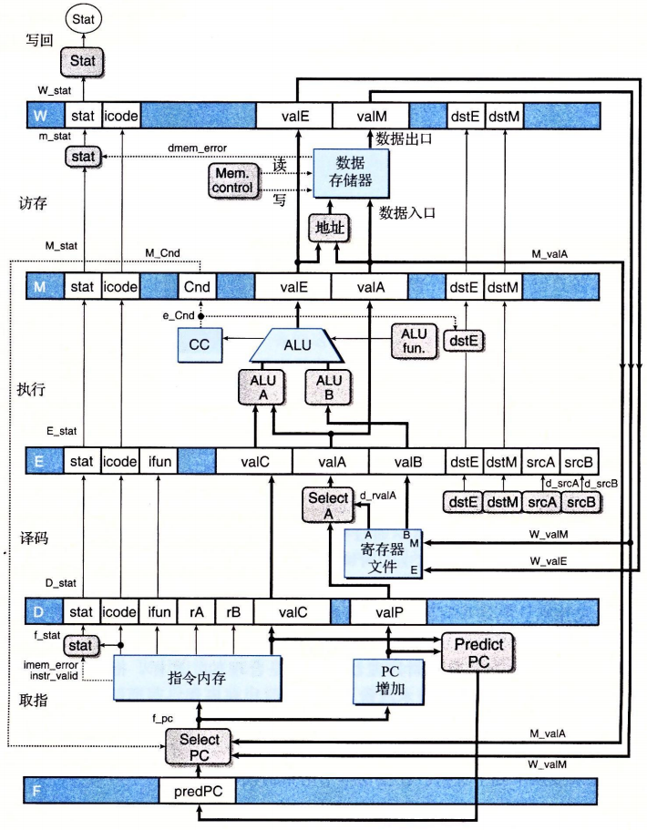

# Y86-64 流水线

针对之前的SEQ顺序架构,做以下调整使之成为一个性能有所提升的流水线设计:

## SEQ+

PC计算从上一个指令的最后调整到当前指令的最开始

## 插入流水线寄存器

增加流水线寄存器(硬件):

* F : 保存程序计数器预测值(由PC增加计算得到)
* D : 取指结果
* E : 译码指令和寄存器值
* M : 执行结果以及CC
* W : 反馈路径写回,以及ret地址

```s
irmovq $1,%rax
irmovq $2,%rbx
irmovq $3,%rcx
irmovq $4,%rdx
halt
```



需要注意的是: Select A 块 : 由于 valP只有在call和jXX时会使用,并且在这两个指令中不会使用valA因此可以用寄存器的这一部分valA 通过Select A选取数据携带带使用的地方,这样就可以减少连线