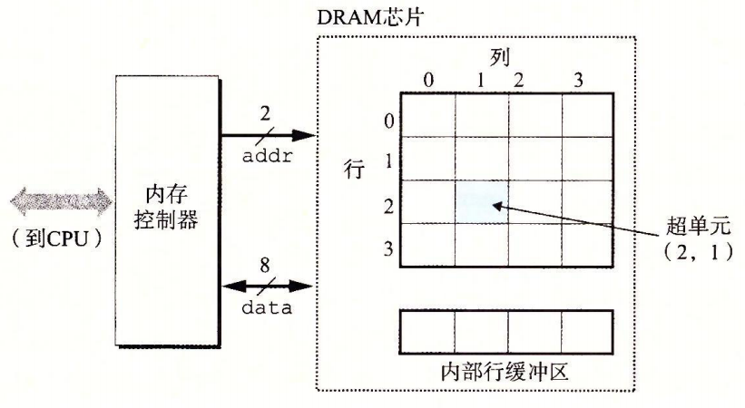

# 存储器技术

## RAM(随机访问存储器)

随机访问存储分为静态和动态的,静态的比动态的快很多,静态的也昂贵很多,SRAM 常用作高速缓存,DRAM 用作主存

### SRAM

SRAM 将一个位存储在一个双稳态的存储单元中.通电情况下始终处于稳态下,任何干扰导致的不稳态,一旦在干扰结束后都会重新偏向稳态.

### DRAM

每位的存储定义为电容的充电,电容电量灰衰减,需要定时刷新.

有些系统定义纠错码，例如64位信息使用72位表示,这样可以随时检查出错误

#### 传统DRAM

w个DRAM组成一个 __超单元__ , 超单元组成DRAM芯片,被组织成r行c列共 d=r*c 大小的长方形阵列.

内存控制器将行地址RAS:i 和列地址CAS:j 发送给DRAM,DRAM 将超单元(i,j) 响应发送给内存控制器

#### 内存模块

DRAM 封装到内存模块中,Core i7 系统使用 240 个引脚的 DIMM 以 64位为块从内存控制器传入& 传出数据.

#### 增强DRAM

* 快页模式 DRAM (FPM DRAM)
* 扩展数据输出DRAM (EDO DRAM)
* 同步DRAM (SDRAM)
* 双倍数据速度同步 DRAM (DDR SDRAM): 根据预取缓冲区大小划分为 DDR DDR2(4位) DDR3(8位) DDR4...
* 视频RAM (VRAM)

## ROM(只读存储器)