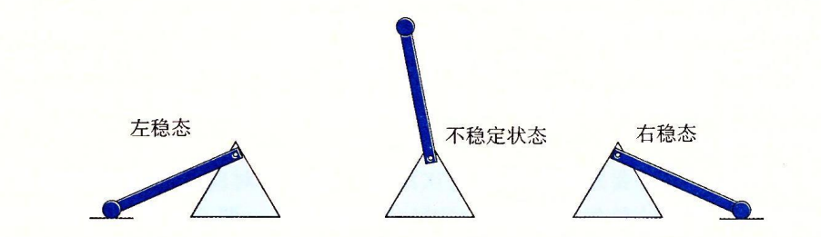

# 存储器技术

## RAM

随机访问存储分为静态和动态的,静态的比动态的快很多,静态的也昂贵很多,SRAM 常用作高速缓存,DRAM 用作主存

### SRAM

SRAM 将一个位存储在一个双稳态的存储单元中.通电情况下始终处于稳态下,任何干扰导致的不稳态,一旦在干扰结束后都会重新偏向稳态.

### DRAM

每位的存储定义为电容的充电,电容电量灰衰减,需要定时刷新.

有些系统定义纠错码，例如64位信息使用72位表示,这样可以随时检查出错误

## ROM