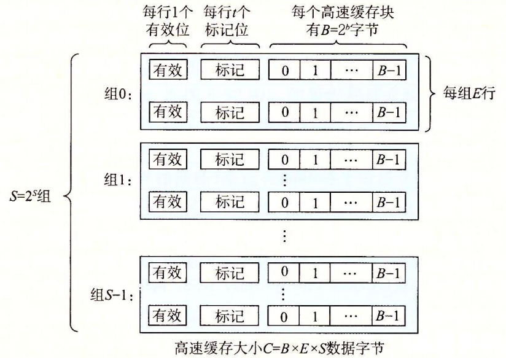
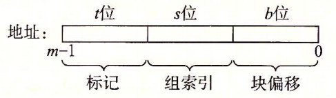

# 高速缓存

早期计算机系统只有CPU寄存器,主存和磁盘三层存储层次结构,由于CPU和主存之间速度的差距越来越大,设计者插入了一个SRAM高速缓存存储器.

* 存储器地址有m位,形成 M = 2^m 个不同的地址.
* 高速缓存被组织成 S = 2^s 个缓存组
* 每个缓存组包含 E 个缓存行
* 每个缓存行有 :
  * B = 2^b 个字节组
  * 一个有效位
  * t = m - (b + s) 个标记位

高速缓存大小 C = S * E * B

如下图:

这样一个存储器地址可以表示为:

举例:

| | m | C | B | E | S | t | s | b |
|----|----|----|----|----|----|----|----|----|
| 1. | 32 | 1024 | 4 | 1 | 256 | 22 | 8 | 2 |
| 2. | 32 | 1024 | 8 | 4 | 32 | 26 | 5 | 3 |
| 3. | 32 | 1024 | 32 | 32 | 1 | 27 | 0 | 5 |

查找顺序:

1. 首先根据m位地址中的 t 找到组索引,
2. 然后根据缓存行标志位t和有效位确认所在缓存行(如果有)
3. 最后根据b位确认在缓存行中的偏移地址

## 直接映射高速缓存

E = 1 即每个缓存组只有一个缓存行

## 组相联高速缓存

## 全相联高速缓存

## 高速缓存写入

## 真实例子

## 高速缓存性能指标
