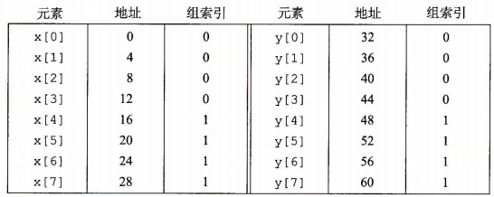
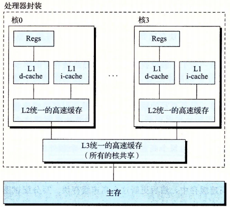
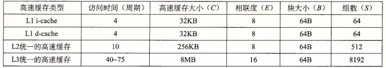

# 高速缓存

早期计算机系统只有CPU寄存器,主存和磁盘三层存储层次结构,由于CPU和主存之间速度的差距越来越大,设计者插入了一个SRAM高速缓存存储器.

* 存储器地址有m位,形成 M = 2^m 个不同的地址.
* 高速缓存被组织成 S = 2^s 个缓存组
* 每个缓存组包含 E 个缓存行
* 每个缓存行有 :
  * B = 2^b 个字节组
  * 一个有效位
  * t = m - (b + s) 个标记位

高速缓存大小 ```C = S * E * B```

如下图:


这样一个存储器地址可以表示为:


举例:

|     | m   | C    | B   | E   | S   | t   | s   | b   |
| --- | --- | ---- | --- | --- | --- | --- | --- | --- |
| 1.  | 32  | 1024 | 4   | 1   | 256 | 22  | 8   | 2   |
| 2.  | 32  | 1024 | 8   | 4   | 32  | 26  | 5   | 3   |
| 3.  | 32  | 1024 | 32  | 32  | 1   | 27  | 0   | 5   |

查找顺序:

1. 首先根据m位地址中的 t 找到组索引,
2. 然后根据缓存行标志位t和有效位确认所在缓存行(如果有)
3. 最后根据b位确认在缓存行中的偏移地址

> 为什么使用中间为作为 __组索引__ 而不使用最高位?
> 当使用最高位时,连续内存将会被映射到同一个缓存组中,如果代码具有良好的空间局部性,将会导致访问这块连续内存时,只有一块or几块(取决于E)被缓存在缓存中.

## 直接映射高速缓存

E = 1 即每个缓存组只有一个缓存行

当出现下面这种映射关系时,会出现缓存抖动



## 组相联高速缓存

1 < E < C/B 即每个缓存组有一个以上的缓存行,并且缓存组多于一个

1. 确定缓存组
2. 检查有效位和标志位
* 命中
* 不命中 a.选择有效位为0的缓存行缓存 b.替换 LFU or LRU

## 全相联高速缓存

E = C/B 即只有一个缓存组0 ,所有内存地址都被映射到缓存组0.

需要比较所有缓存行的标记位,当太大时不够效率,因此适合小容量的缓存设计

## 高速缓存写入

* 写明中
  * 直写 : 写入缓存 写入内存
  * 写回 : 写入缓存 当缓存被替换时再写入内存
* 写不命中
  * 非写分配 : 直接写入内存
  * 写分配 : 加载缓存 写入缓存 __写回__

## 真实例子





## 局部性

### 空间局部性

* 依次访问连续内存 ```x[0]``` ```x[1]``` ```x[2]``` ```x[3]```
* 指令顺序执行 指令的空间局部性

### 时间局部性

* 循环变量 ```for(int i = 0; i <= 10 ; i++){}```  变量 i 的使用具有时间局部性

## 高速缓存性能指标

* 命中率/不命中率
* 命中时间 : 命中缓存传送到CPU的时间
* 不命中惩罚 : 不命中从下级缓存获取数据的时间

影响 :

1. C : 缓存大小,较大缓存提高命中率但是读写速度回受到影响
2. B : 块大小,大块提高空间局部性的影响,但是会较少缓存行,降低时间局部性的影响,同时不命中时移动数据块会消耗更多时间
3. E : 相联度 相联度高,降低抖动,但是设计会更复杂,需要更多标志位和判断逻辑电路
4. 写策略 : 低层存储器上较多的采取写回策略,因为写回可能减少写入的数据量