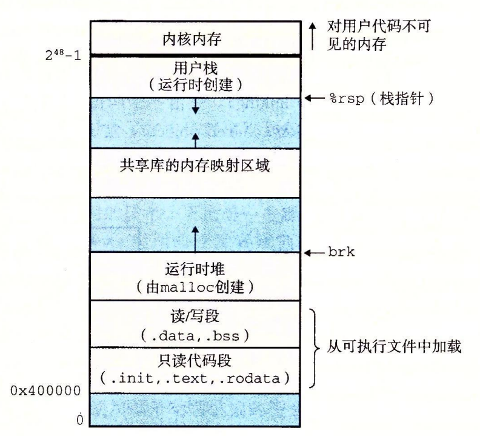

# 静态链接

## 静态链接与目标文件

通过符号解析和重定位将多个多个目标文件合并为一个可执行目标文件,目标文件主要有可重定位(用于编译生成可执行文件),可执行(直接复制到内存运行)以及共享(执行时动态加载)

目标文件不同操作系统上格式有所不同但是大同小异 : PE Mach-O ELF

## 可重定位目标文件

* ELF 头 : 65/32 , 字节序
* .text : 机器码
* .rodata : 只读数据 switch 语句中的跳转表
* .data : 已初始化全局静态变量
* .bss : 未初始化全局静态变量,目标文件中不占据空间,运行时分配
* .symtab : 符号表
* .rel.text : .text 节位置列表
* .rel.data : .data 节位置列表
* .debug : 调试符号
* .line : 行号与 .text 指令关系
* .strtab : 字符串表

## 符号表

符号表项:

```c
/* $begin elfsymbol */
typedef struct {
  int name;        /* string table offset */
  int value;       /* section offset, or VM address */
  int size;        /* object size in bytes */
  char type:4,     /* data, func, section, or src file name (4 bits) */
  binding:4;       /* local or global (4 bits) */
  char reserved;   /* unused */  
  char section;    /* section header index, ABS, UNDEF, */
                   /* or COMMON  */  
} Elf_Symbol;
/* $end elfsymbol */

/* $begin elfrelo */
typedef struct {
  int offset;     /* offset of the reference to relocate */
  int symbol:24,  /* symbol the reference should point to */
  type:8;     /* relocation type */
} Elf32_Rel;
/* $end elfrelo */
```

## 符号解析

* 强符号: 函数以及已初始化全局变量
* 弱符号: 未初始化全局变量

1. 不允许有多个重名的强符号
2. 一个强符号多个弱符号 选择强符号
3. 多个弱符号随机一个

### 静态库

如果引用到多个目标文件 例如 printf.o scanf.o 静态链接时后命令行就会复杂很多,因此引入了静态库的概念,将多个目标文件打包成一个静态库 `.o -> .a` ,链接时直接引用静态库,链接器会自己判断需要静态库中的哪些目标模块并选择打包,没有使用的不会打包.

```shell
.c -cc-> .o
.o + .o -ld-> .o
.o + .o -ar-> .a
.o + .a -ld-> .o
```

## 重定位

完成符号解析后,链接器就可以将符号引用(当前目标文件中引用)和符号定义(这些定义在外部目标文件中)对应起来,接下来就执行重定位

* 合并同种类型的节
* 更新代码节和数据节中的符号引用.通过 .rel.text 和 .rel.data 中的通过重定位条目,其数据结构如下:

```c
/* $begin elfrelo */
typedef struct {
  int offset;     /* offset of the reference to relocate */
  int symbol:24,  /* symbol the reference should point to */
  type:8;     /* relocation type */
} Elf32_Rel;
/* $end elfrelo */
```

objdump -dx main.o

```s
Disassembly of section .text:

0000000000000000 <main>:
  0:  55                     push   %rbp
  1:  48 89 e5               mov    %rsp,%rbp
  4:  48 83 ec 10            sub    $0x10,%rsp
  8:  be 02 00 00 00         mov    $0x2,%esi
  d:  48 8d 3d 00 00 00 00   lea    0x0(%rip),%rdi        # 14 <main+0x14>
    10: R_X86_64_PC32  array-0x4
  14:  e8 00 00 00 00         callq  19 <main+0x19>
    15: R_X86_64_PLT32  sum-0x4
    # 第14 行 的 callq 指令是在链接时 需要被链接器根据main 和 sum的实际地址修改的 修改依据如下:
    # 15: R_X86_64_PLT32  sum-0x4
    # r.offset = 19
    # r.symbol = sum
    # r.type = R_X86_64_PLT32
    # r.addend = - 0x4
    # 计算实际引用地址
    # refptr = (ADDR(r.symbol) + r.addend - (ADDR(main) + r.offset))
    # = 0x000000000000061b + (-0x4) - (0x00000000000005fa + 19)
    # = 0x5
    # 60a: e8 05 00 00 00    callq  614 <sum>
  19:  89 45 fc               mov    %eax,-0x4(%rbp)
  1c:  8b 45 fc               mov    -0x4(%rbp),%eax
  1f:  c9                     leaveq
  20:  c3                     retq

```

## 可执行目标文件

可执行文件头部 定义了加载到内存中的行为:

```shell
...
  LOAD off    0x0000000000000000 vaddr 0x0000000000000000 paddr 0x0000000000000000 align 2**21
        filesz 0x0000000000000850 memsz 0x0000000000000850 flags r-x # 代码段
  LOAD off    0x0000000000000df0 vaddr 0x0000000000200df0 paddr 0x0000000000200df0 align 2**21
        filesz 0x0000000000000228 memsz 0x0000000000000230 flags rw- # 数据段
...
```

### 代码段

从文件 0x0000000000000000 加载到 vaddr 的 0x0000000000000000 文件大小 0x850

### 数据段

从文件的 0x0000000000000df0 加载到内存 0x0000000000200df0 ,供 0x230字节, 0x228 用于已初始化数据,剩余 8个字节用于 初始化为0 的数据 同时需要满足对齐要求:

```vaddr mod align == off mod align```

实际中内存分布可能类似下面的情况:

