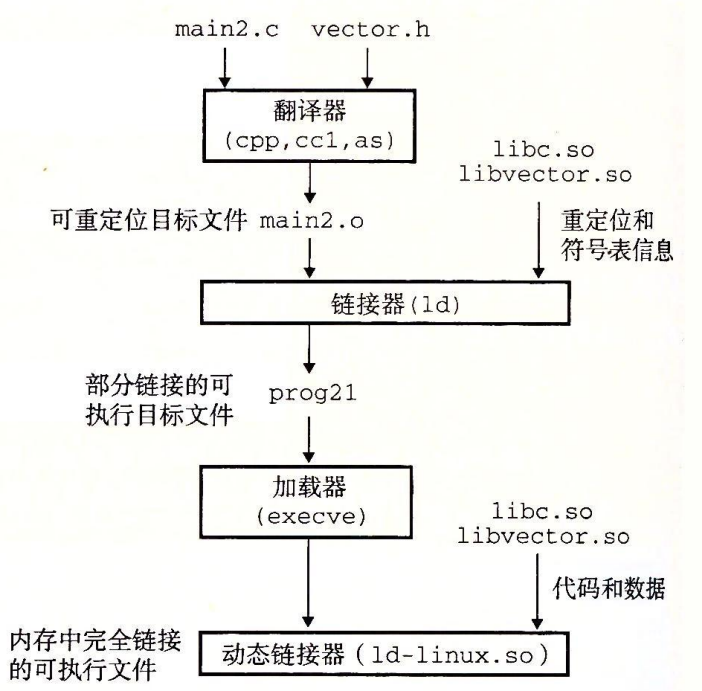

# 动态链接共享库

```shell
root@ubuntu-server:~/code/csapp/link2# ll
-rwxrwxrwx 1 root root  183 Nov 23 07:10 addvec.c*
-rwxrwxrwx 1 root root  243 Nov 23 07:10 main2.c*
-rwxrwxrwx 1 root root  188 Nov 23 07:10 multvec.c*
-rwxrwxrwx 1 root root  136 Nov 23 07:10 vector.h*
root@ubuntu-server:~/code/csapp/link2# gcc -shared -fpic -o libvector.so addvec.c multvec.c
root@ubuntu-server:~/code/csapp/link2# gcc -o prog21 main2.c ./libvector.so
root@ubuntu-server:~/code/csapp/link2# ll
-rwxrwxrwx 1 root root  183 Nov 23 07:10 addvec.c*
-rwxrwxrwx 1 root root 7504 Nov 23 07:11 libvector.so*
-rwxrwxrwx 1 root root  243 Nov 23 07:10 main2.c*
-rwxrwxrwx 1 root root  188 Nov 23 07:10 multvec.c*
-rwxrwxrwx 1 root root 8424 Nov 23 07:12 prog21*
-rwxrwxrwx 1 root root  136 Nov 23 07:10 vector.h*
```



## 应用程序加载和链接共享库

```shell
root@ubuntu-server:~/code/csapp/dll# ll
total 12
drwxrwxrwx 1 root root    0 Nov 23 07:23 ./
drwxrwxrwx 1 root root    0 Nov 23 07:23 ../
-rwxrwxrwx 1 root root  916 Nov 23 07:22 dll.c*
-rwxrwxrwx 1 root root 7504 Nov 23 07:11 libvector.so*
root@ubuntu-server:~/code/csapp/dll# gcc -rdynamic -o prog2r dll.c -ldl
root@ubuntu-server:~/code/csapp/dll# ll
total 28
drwxrwxrwx 1 root root     0 Nov 23 07:24 ./
drwxrwxrwx 1 root root     0 Nov 23 07:23 ../
-rwxrwxrwx 1 root root   916 Nov 23 07:22 dll.c*
-rwxrwxrwx 1 root root  7504 Nov 23 07:11 libvector.so*
-rwxrwxrwx 1 root root 12776 Nov 23 07:24 prog2r*
root@ubuntu-server:~/code/csapp/dll# ./prog2r
z = [4 6]
```

## 位置无关代码

编译共享链接库时使用了参数 `-fpic` ,用来生成位置无关代码. 这样可以加载并无需重定位共享库.位置无关只要涉及到数据和代码 :

### PIC数据引用

本小节将要解释: 动态链接库在被调用时,动态链接库的函数如何确定全局变量的位置:

数据段与代码段距离总是保持不变,根据这一点在数据段开始的地方创建全局偏移量表(GOT)


### PIC函数调用

本小节将要解释: 可执行目标文件调用动态链接库时,如何确定动态链接库的全局变量和函数的位置:

通过当前目标文件的GOT 和过程链接表(PLT)实现延迟绑定(lazy binding):


运行第一次时callq *GOT[4],通过跳转和调用函数的 ID 通过链接器(步骤4 jump *GOT[2])载入调用函数的地址并放入 GOT[4],再次调用时就可以直接使用了.

第一次调用开销很大,但是之后的调用只需要一个指令和内存引用

## 库打桩机制

通过打桩 追踪 函数malloc free的调用.

具体可以查看 [实验](./src/interpose/README)