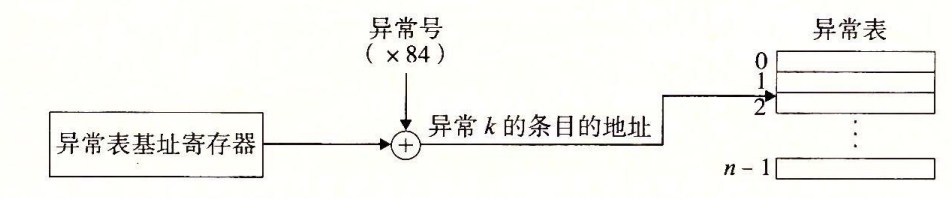
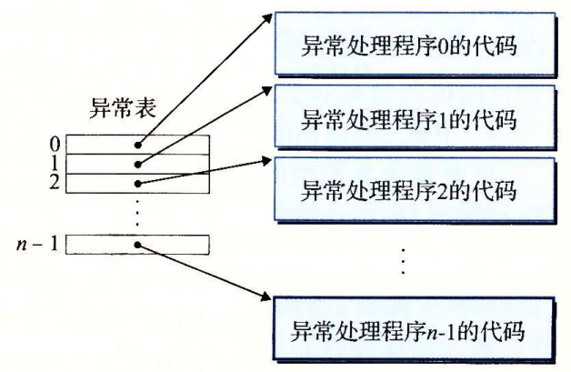

# 异常控制流

异常处理用来响应处理器状态的某些变化.





## 异常分类

中断是外部I/O 信号导致的异步异常,其他(陷阱,故障,中断)都是由于当前指令引起的同步异常

### 中断

外部I/O 设备发出信号引发中断,处理器执行完当前指令后检测到这一信号,然后中断跳转到对应的异常处理代码.处理完后跳转回执行下一指令.

### 陷阱

陷阱是有意的异常,最重要的作用是提供系统调用(syscall).

```s
# #include "csapp.h"
# int main()
# {
#   write(1, "hello, world\n", 13);
#   _exit(0);
# }

.section .data
string:
  .ascii "hello, world\n"
string_end:
  .equ len, string_end - string
.section .text
.globl main
main:
    # First, call write(1, "hello, world\n", 13)
    movq $1, %rax        # System call number 1
    movq $1, %rdi        # stdout has descriptor 1
    movq $string, %rsi   # Hello world string
    movq $len, %rdx      # String length
    syscall

    # Next, call exit(0)
    movq $60, %rax       # System call number 60
    movq $0, %rdi        # Argument is 0
    syscall
```

### 故障

典型的故障时缺页异常,当读取一个地址,发现缺页,会引发缺页异常,系统加载缺页的内存,然后重新执行当前指令.

### 终止

不可恢复的致命错误

## 进程

异常控制是实现进程的一个重要概念

* 多任务实现进程并发
> 并发: 两个进程的执行在时间上重叠,称为并发,比如在一个CPU上轮流执行,或者在两个CPU上并行执行都称为并发
> 并行是并发的一个真子集.指的是同时执行
* 虚拟内存系统实现私有地址空间,逻辑上实现对内存的独占
* 进程运行在两种模式下:用户模式和内核模式,内核模式下才可以进行I/O等操作
* 上下文切换: 内核为每个进程维护一个上下文.内核通过上下文切换机制将控制调度到新的进程上

Unix 提供了大量操作进程的C API,例如获取进程ID,创建和终止进程等,这些都是系统调用.

## 信号

信号是一种更高层次的软件形式的异常.待处理状态即发出还没被接收,一个进程只能有一个类型的待处理信号.一个待处理信号只能被处理一次.可以通过阻塞忽略信号.维护pending 向量和blocked 向量实现信号处理和阻塞.

### 发送信号

通过 kill / Ctrl + C / kill 函数 / alerm 函数等发送信号

### 接收信号

```c
/* $begin sigint */
#include "csapp.h"

void sigint_handler(int sig) /* SIGINT handler */   //line:ecf:sigint:beginhandler
{
    printf("Caught SIGINT!\n");    //line:ecf:sigint:printhandler
    exit(0);                      //line:ecf:sigint:exithandler
} //line:ecf:sigint:endhandler

int main()
{
    /* Install the SIGINT handler */
  if (signal(SIGINT, sigint_handler) == SIG_ERR)  //line:ecf:sigint:begininstall
  unix_error("signal error");                 //line:ecf:sigint:endinstall
  pause(); /* Wait for the receipt of a signal */  //line:ecf:sigint:pause
  return 0;
}
/* $end sigint */
```

### 信号处理程序

处理程序编写需要考虑一下问题 :

* 安全 : 信号处理程序需要考虑并发问题.
* 正确 : 未处理的信号不排队,即每种类型只能有一个未处理信号,并且一个信号只能处理一次
* 可移植性