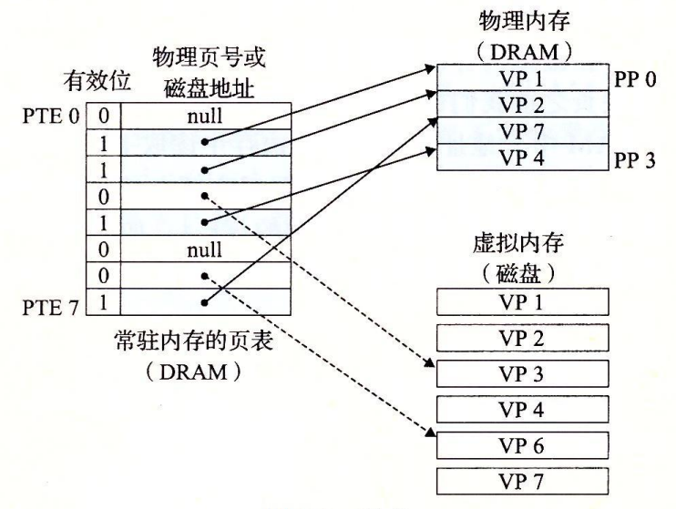
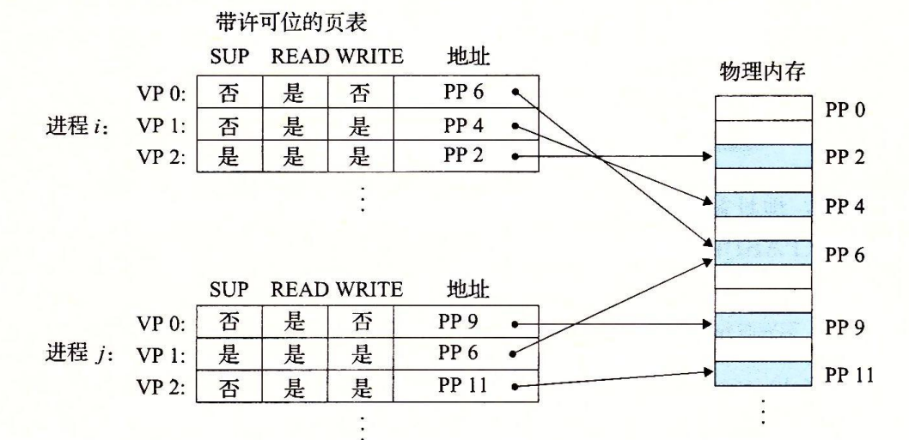

# 虚拟内存

CPU 通过一个虚拟地址(VA)访问主存,虚拟地址在到达主存前通过内存管理单元(MMU)翻译成物理地址.

虚拟地址 N = 2 ^ n ,每个进程虚拟地址空间都是互相独立的.通过OS 管理.使用虚拟地址比物理地址最显而易见的好处是,设计简单,进程不需要关心OS 如何分配内存.

## 缓存

虚拟内存被分为大小为P(2 ^ p字节)的虚拟页(VP),物理内存也被分为大小为P的物理页,又称为页帧(page frame)

虚拟页有三种状态 : 未分配(没有使用) 缓存(分配在物理内存中) 未缓存(没有分配在物理内存中,访问会发生缺页中断,会导致页缓存)

由于大的不命中出发和访问第一个字开销,虚拟页一般比较大:4K-2M.

虚拟内存系统由操作系统,MMU以及存放在物理内存中的页表等软硬件配合实现.

当访问的虚拟地址在页表中无效时机引发缺页.OS 需要从磁盘中读取这一页,然后复制到物理内存中如果物理内存中已经缓存了其他页面,则需要替换(页面调度).

可能会引发担心的是 : 发生多个页面频繁被反复调度的情况,然而实际中良好的局部性(无论是空间局部性还是时间局部性)会保证进程在一个时间段只会在一个很小的工作集上工作.但是如果不合理的局部性,工作集超过了物理内存大小,则会导致虚拟页被频繁替换出入,这叫抖动.

## 内存管理

操作系统为每个进程维护了单独的页表.

使用虚拟内存,简化程序链接加载逻辑.同时进程间共享数据(动态链接库)也变得非常容易实现.

## 内存保护

增加页表项许可位提供页面级内存保护.

