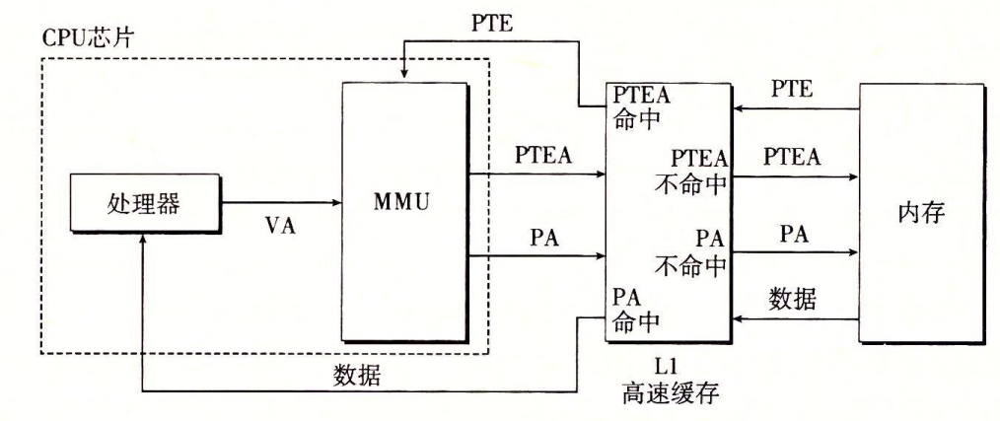
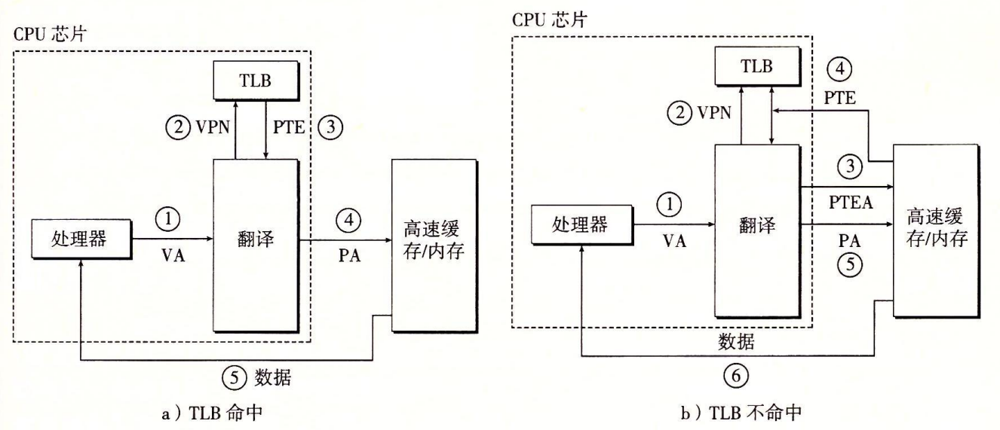
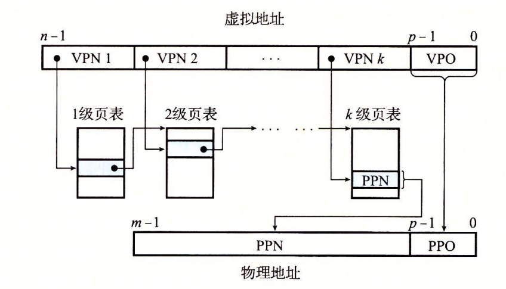
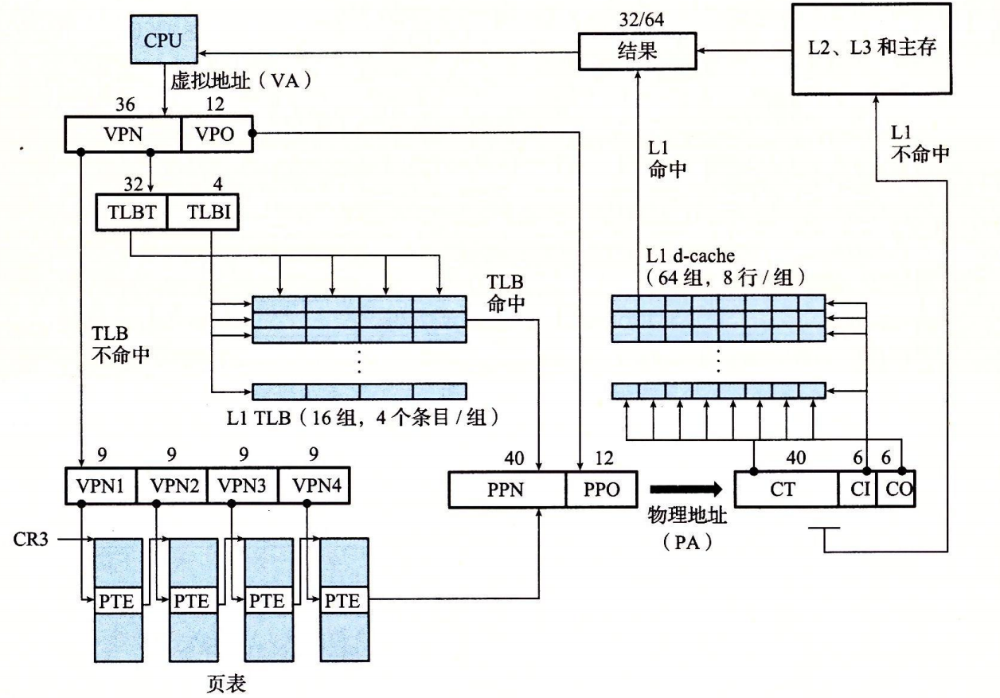
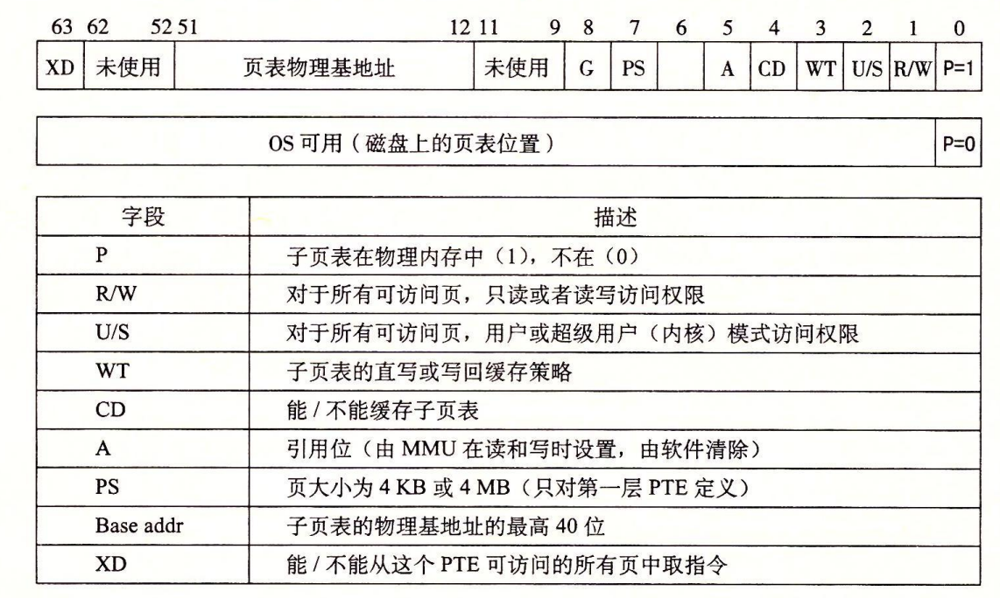
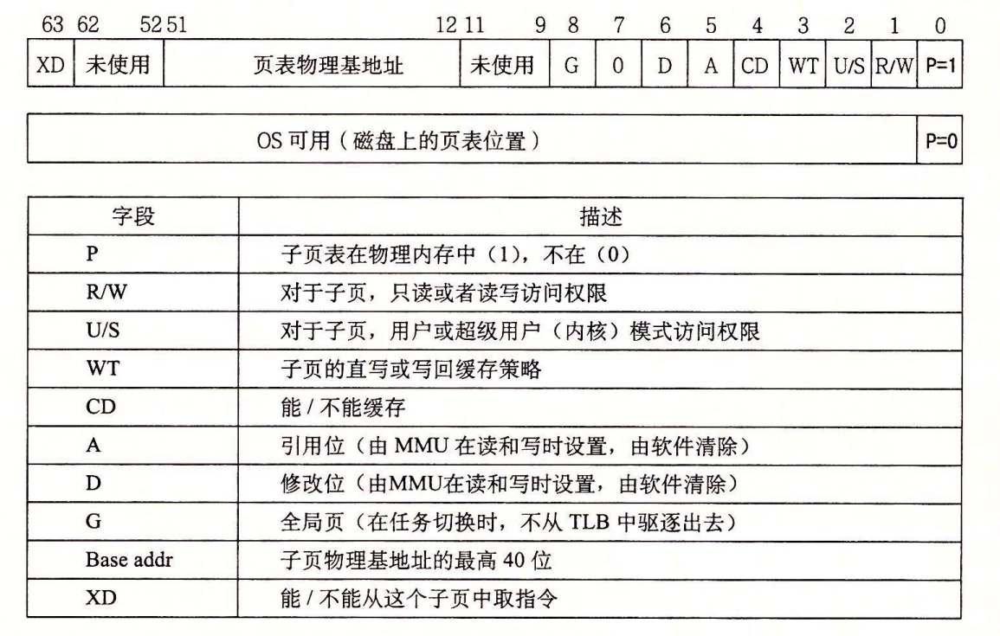

# 地址翻译

## 一些基本符号

* PTBR : 页表基址寄存器,指向当前页表
* N = 2 ^ n : 虚拟内存大小
* M = 2 ^ m : 物理内存大小
* P = 2 ^ p : 页大小
* VA : 虚拟地址
  * VPO : 虚拟页面偏移量(字节)
  * VPN : 虚拟页号,(`VPN = TLBI + TLBT`分割为两部分用来检索TLB缓存
    * TLBI : TLB 索引
    * TLBT : TLB 标记
* PA : 物理地址(`PA = PPO + PPN` 用来访问物理内存,`PA = CO + CI + CT` 用来检索高速缓存中是否缓存了对应的内存块)
  * PPO : 物理页面偏移量(字节),等于 VPO
  * PPN : 物理页号
  * CO : 高速缓存块内偏移量(字节)
  * CI : 高速缓存索引
  * CT : 高速缓存标记

## 通过VA访存

通过VA访问内存的过程如下 :

## TLB

从上图中可以看出: 每次通过VA访问内存都要查询一次 PTE,如果情况比较糟糕,恰好每次访问的PTE 都没有缓存在L1中,那就会多一次内存访问,这样的开销是很大的.因此MMU中集成了 TLB (翻译后备缓冲器),用来专门缓存PTE.

TLB 每个行都缓存了一个PTE.通过VA中 VPN 即 TLBI + TLBT 检索TLB.由于TLB较小,相联度一般都比较高,甚至可以全相联(TLBI位数为0) .

## 多级页表

如果将 VPN 分为多个部分,每个部分都用来确定一级页表.可以实现多级页表的设计.这样可以节省部分空间,尤其是64位情况下.

## Corei7地址翻译

Core i7 支持32/48/52/64 位虚拟地址空间.

L1 L2 L3 是物理寻址缓存.

TLB是虚拟寻址缓存.

下面是i7地址翻译情况(48位虚拟地址)

多级页表中的1-3级页表项格式

多级页表中的4级页表项格式

MMU翻译VA时,将 VPN 发送到TLB获取PPN,同时将 VPO发送到L1检索对应的缓存项目.L1被设计为8路相联,有64个组合64字节大小的缓存块,因此使用VPO前六位刚好作为 L1的 CI,当 PPN返回时,刚好使用PPN 作为 CT判断是否缓存.这样就可以节省了部分时间了.

## Linux内存系统

进程任务信息 :`task_struct` 中维护了进程的PID PC等信息,以及 内存分配情况 `mm_struct`,这个结构中有两个关键的字段 : `vm_area_struct` 是一个链表,描述了当前虚拟地址的区域情况,而另一个指针 `pgd` 指向第一级页表.