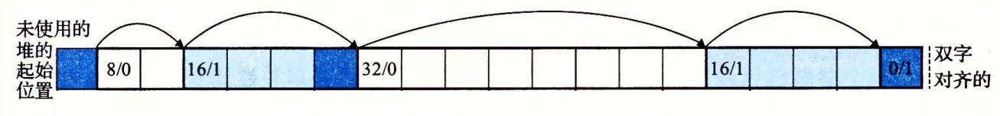

# 内存映射与动态分配

## 内存映射

将磁盘上的文件映射到一块内存区域

共享对象

私有对象 : 写时复制

## 动态分配

### 分配器的要求和目标

* 处理任意请求序列
* 立即响应
* 只使用堆
* 对齐
* 不改变已分配块

**吞吐率**与**利用率**的平衡

### 碎片

* 内部碎片 : 已分配的比请求的大,比如请求5 但是由于对齐,分配6
* 外部碎片 : 分散的空闲空间

### 隐式空闲链表

用来区分边界,如图所示(一个方格表示一个32bits的字)

### 查找空闲块

* 首次适配 : 每次从最开始查找
* 下一次适配 : 每次从上次找到的位置开始查找
* 最佳适配 : 查找所有空闲块,然后选择最小的分配需要的空间

### 分割空闲块

从空闲块分配请求空间后需要按照隐式链表分割

### 合并空闲块

释放后可以将前后相邻的空闲块合并

可以选择释放后立刻合并,也可以等待某个稍晚时间合并以防止合并后又申请然后分割导致抖动

释放后合并后面的空闲块hen方便,因为根据当前块可以找到下一个块的头部然后判断是否空闲.

但是合并前一个块就比较麻烦了,Knuth提出了一种边界标记: 在块结尾添加一个Footer,是头部的副本

### 显式空闲链表

空闲块增加前继和后继指针,指向其他空闲块,形成链表

链表前继后继规则: 一种是FIFO, 刚刚释放的空闲块总是在链表最开始,然后按照后继遍历链表找到合适的空闲块,有比较高的吞吐率,另一种是按照地址顺序,这样有更高的利用率

### 分离的空闲链表

维护多个空闲链表,每个链表中块大小大致相同.这样可以按需查找空闲链表,提高吞吐率和利用率.