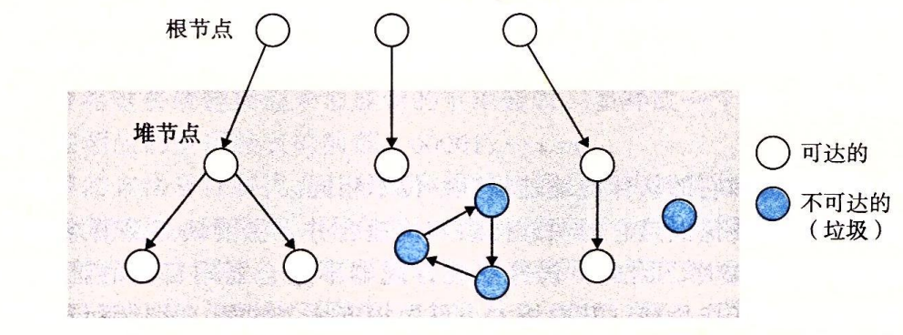

# 虚拟内存相关的其他知识

## 垃圾回收



Mark&Sweep 算法,先标记为不可达,然后从根开始遍历标记是否可达,最后将不可达对象释放.

## C语言中与内存有关的错误

### 引用坏指针

```c
scanf("%d",&val);
// 将 int 值作为地址传递.很可能引发异常
scanf("%d",val);
```

### 读取未初始化区域

例如 ```malloc(8)``` 但是访问的区域却不只 8,越界访问

### 栈缓冲区溢出

```c
char buf[64];
gets(buf); // 可能输入不止64 byte
```

### int和指针大小

int 长度 32
指针根据系统不同长度不同

### 错位错误

创建数组长度`n` ,试图修改`n+1` 位置内存

### 指针运算符优先级

`*` 运算符是右结合的:

```c
*ptr --; //*(ptr --)
(*ptr) --;
```

### 误解指针运算

```c
ptr ++ ; //  ++ 并非是 +1 而是根据指针指向数据类型计算的
```

### 野指针

释放内存后继续引用

```c
int *test(){
  int val = 10;
  return &val;
}
```

### 内存泄漏

申请后忘记释放